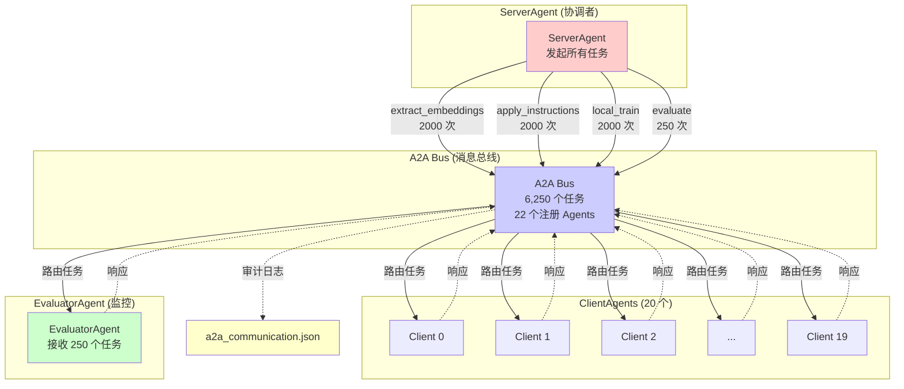
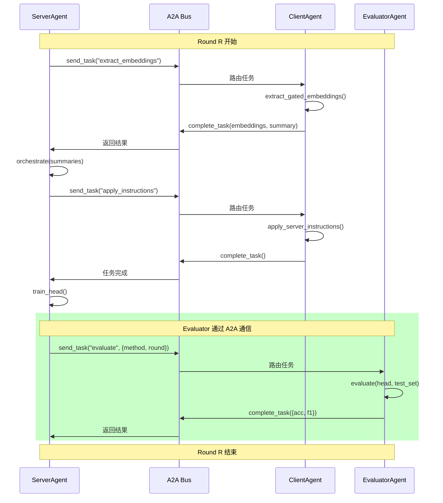

# A2A 通信拓扑完整文档

## 概述

你的项目中，**所有 Agent 间通信都通过 A2A 协议**进行，包括：
- ✅ Server ↔ Clients (20 个客户端)
- ✅ Server ↔ Evaluator (1 个评估器)

## 通信拓扑图



## 详细通信统计

### 1. Server → Clients (6,000 次, 96%)

#### 1.1 extract_embeddings (2,000 次)
- **频率**: 每轮每客户端 1 次
- **计算**: 100 轮 × 20 客户端 = 2,000
- **用途**: AO-FRL 方法
- **消息内容**:
  ```json
  Request:  {"round": 10, "n_views": 2}
  Response: {
    "label_histogram": [...],
    "reject_ratio": 0.16,
    "sigma": 0.02,
    "n_uploaded": 950
  }
  Artifacts: gated_embeddings (size_bytes: ~1MB)
  ```

#### 1.2 apply_instructions (2,000 次)
- **频率**: 每轮每客户端 1 次
- **计算**: 100 轮 × 20 客户端 = 2,000
- **用途**: AO-FRL 方法
- **消息内容**:
  ```json
  Request: {
    "client_id": 5,
    "upload_budget": 970,
    "sigma": 0.02,
    "augmentation_mode": "conservative"
  }
  Response: (空，任务完成)
  ```

#### 1.3 local_train (2,000 次)
- **频率**: 每轮每客户端 1 次
- **计算**: 100 轮 × 20 客户端 = 2,000
- **用途**: FedAvg 基线
- **消息内容**:
  ```json
  Request:  {"round": 10, "local_epochs": 3}
  Response: (空)
  Artifacts: state_dict (size_bytes: ~0.63MB)
  ```

### 2. Server → Evaluator (250 次, 4%)

#### evaluate 任务
- **频率**: 每个方法每轮 1 次
- **计算**:
  - Centralized: 50 轮 × 1 = 50
  - FedAvg: 100 轮 × 1 = 100
  - AO-FRL: 100 轮 × 1 = 100
  - **总计**: 250 次
- **消息内容**:
  ```json
  Request: {
    "method": "AO-FRL",
    "round": 10
  }
  Response: {
    "acc": 0.6240,
    "f1": 0.6190
  }
  ```

## 通信模式对比

| 通信模式 | 任务数 | 占比 | 平均耗时 | 数据量 |
|---------|--------|------|----------|--------|
| Server → Clients (extract) | 2,000 | 32.0% | 0.273s | ~1MB/次 |
| Server → Clients (instruct) | 2,000 | 32.0% | 0.000s | ~100B/次 |
| Server → Clients (train) | 2,000 | 32.0% | 0.208s | ~0.63MB/次 |
| **Server → Evaluator** | **250** | **4.0%** | **0.014s** | **~78B/次** |
| **总计** | **6,250** | **100%** | - | - |

## 关键发现

### ✅ EvaluatorAgent 确实使用 A2A 协议

1. **注册在 A2A Bus**:
   ```python
   bus.register_agent(AgentCard("evaluator", "EvaluatorAgent",
                                "Global model evaluation",
                                ["evaluate"]))
   ```

2. **接收 evaluate 任务**:
   - 总共 250 次任务
   - 占所有任务的 4%
   - 来自 3 个方法的评估

3. **通信特点**:
   - ✅ 轻量级（~78 字节/次）
   - ✅ 快速（平均 0.014 秒）
   - ✅ 高频率（每轮必调用）

### 通信效率

```
EvaluatorAgent 通信:
├─ 请求大小: ~40 字节 (JSON: method, round)
├─ 响应大小: ~38 字节 (JSON: acc, f1)
├─ 总计: ~78 字节/次
└─ 250 次 × 78B = 19.5 KB (极小！)

对比 ClientAgents 通信:
├─ 嵌入上传: ~1 MB/次
├─ 2,000 次 × 1MB = 2 GB
└─ Evaluator 通信仅占 0.001% 的数据量
```

## 为什么 Evaluator 也用 A2A？

### 优势

1. **统一的通信协议**
   - 所有 Agent 间交互都遵循相同标准
   - 简化系统架构

2. **完整的审计日志**
   - 记录每次评估请求和响应
   - 可追溯性和可复现性

3. **解耦设计**
   - Evaluator 可以独立部署
   - 便于分布式扩展

4. **可扩展性**
   - 未来可以添加多个 Evaluator
   - 或添加其他监控 Agent

### 代码模式一致性

```python
# 所有 Agent 通信都遵循相同模式:

# 1. 发送任务
t = bus.send_task(sender, receiver, task_type, message_parts)

# 2. 执行操作
result = agent.do_something(...)

# 3. 完成任务
bus.complete_task(t.task_id, response_parts, artifacts)
```

## A2A Bus 的作用

### 功能

1. **消息路由**
   - 根据 receiver_id 路由任务
   - 支持点对点通信

2. **任务管理**
   - 分配唯一 task_id
   - 跟踪任务状态（pending → in_progress → completed）

3. **审计日志**
   - 记录所有任务的完整生命周期
   - 包括时间戳、耗时、数据量

4. **性能监控**
   - 统计每种任务类型的平均耗时
   - 识别瓶颈

### 日志示例

```json
{
  "task_id": "5972625955a9",
  "task_type": "evaluate",
  "sender": "server",
  "receiver": "evaluator",
  "state": "completed",
  "created_at": 1770705409.474125,
  "completed_at": 1770705409.4957912,
  "duration_s": 0.0217,
  "n_messages": 2,
  "payload_bytes": 78
}
```

## 时序图：单轮完整通信



## 论文写作建议

### 强调点

1. **完全基于 A2A 协议**
   ```
   "All inter-agent communication in our framework follows the
   Agent-to-Agent (A2A) protocol, including server-client coordination
   and server-evaluator monitoring. This unified approach ensures
   consistent message routing, complete auditability, and system
   extensibility."
   ```

2. **22 个 Agents, 6,250 个任务**
   ```
   "During 100 communication rounds, our system orchestrated 6,250
   A2A tasks across 22 agents (1 server, 20 clients, 1 evaluator),
   with complete audit trails recorded for reproducibility."
   ```

3. **分离关注点**
   ```
   "The EvaluatorAgent is decoupled from training logic through A2A
   messaging, enabling independent model assessment and potential
   distributed deployment."
   ```

### 图表建议

**Figure: A2A Communication Architecture**
- 展示 ServerAgent 与所有 Agents 的通信拓扑
- 标注任务类型和频率
- 强调 Evaluator 也是通过 A2A 通信

## 总结

| 问题 | 答案 |
|------|------|
| EvaluatorAgent 用 A2A 吗？ | ✅ **是的** |
| 通信频率 | 250 次 (每个方法每轮1次) |
| 占比 | 4% 的任务数，0.001% 的数据量 |
| 任务类型 | "evaluate" |
| 消息大小 | ~78 字节/次 (极轻量) |
| 平均耗时 | 0.014 秒 (很快) |

**你的系统是一个完整的、统一的 A2A 架构！** 🎉
