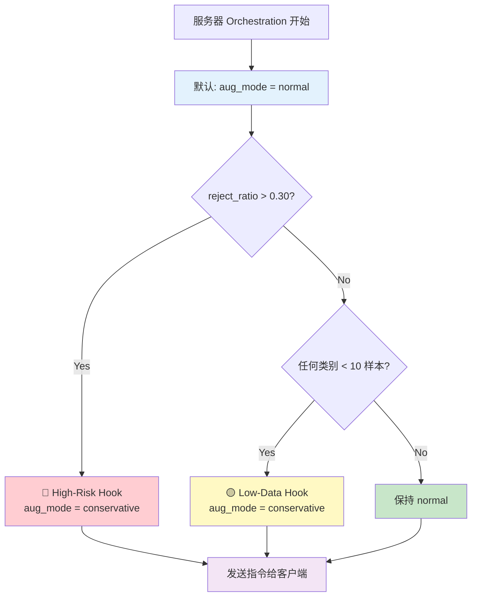

# Augmentation Mode 详解

## 两种模式

Server Agent 可以给客户端分配两种数据增强模式：

---

## 1️⃣ Normal Mode (正常模式)

### 定义
```python
# 代码位置: agents/client_agent.py:54-60
self.aug_normal = T.Compose([
    T.RandomResizedCrop(224, scale=(0.6, 1.0)),  # 随机裁剪 60-100%
    T.RandomHorizontalFlip(),                     # 随机水平翻转
    T.ColorJitter(0.4, 0.4, 0.4, 0.1),           # 颜色抖动
    T.ToTensor(),
    T.Normalize([0.485, 0.456, 0.406],
                [0.229, 0.224, 0.225]),
])
```

### 特点

| 操作 | 参数 | 效果 | 强度 |
|------|------|------|------|
| **RandomResizedCrop** | scale=(0.6, 1.0) | 随机裁剪 60-100% 的区域 | 🔥🔥🔥 强 |
| **RandomHorizontalFlip** | p=0.5 | 50% 概率水平翻转 | 🔥 中等 |
| **ColorJitter** | brightness=0.4<br/>contrast=0.4<br/>saturation=0.4<br/>hue=0.1 | 颜色随机变化 | 🔥🔥 强 |

### 优点
✅ **数据多样性高** - 每次增强差异大
✅ **泛化能力强** - 学到更鲁棒的特征
✅ **适合数据充足** - 可以"浪费"一些样本

### 缺点
❌ **容易过度变形** - 可能改变语义
❌ **稀有类风险** - 少量样本被过度扰动可能丢失信息
❌ **不稳定** - 同一样本多次增强差异大

### 适用场景
- ✅ 数据充足（每类 > 50 样本）
- ✅ 隐私风险低（reject_ratio < 30%）
- ✅ 需要强正则化

---

## 2️⃣ Conservative Mode (保守模式)

### 定义
```python
# 代码位置: agents/client_agent.py:61-67
self.aug_conservative = T.Compose([
    T.Resize(256),              # 固定缩放到 256×256
    T.CenterCrop(224),          # 中心裁剪到 224×224
    T.RandomHorizontalFlip(),   # 随机水平翻转 (保留)
    T.ToTensor(),
    T.Normalize([0.485, 0.456, 0.406],
                [0.229, 0.224, 0.225]),
])
```

### 特点

| 操作 | 参数 | 效果 | 强度 |
|------|------|------|------|
| **Resize** | 256 | 固定缩放（不是随机） | - 确定性 |
| **CenterCrop** | 224 | 中心裁剪（不是随机） | - 确定性 |
| **RandomHorizontalFlip** | p=0.5 | 50% 概率水平翻转 | 🔥 中等 |
| ~~ColorJitter~~ | - | **移除** | - |

### 优点
✅ **保留更多原始信息** - 变形少
✅ **稳定性高** - 同一样本增强一致
✅ **适合稀有类** - 不会过度扰动少量样本
✅ **可预测** - 行为确定

### 缺点
❌ **多样性低** - 数据增强效果弱
❌ **泛化能力弱** - 可能过拟合
❌ **正则化不足** - 数据充足时效果差

### 适用场景
- ✅ 数据稀缺（任何类 < 10 样本）
- ✅ 隐私风险高（reject_ratio > 30%）
- ✅ 需要稳定性

---

## 对比示例

### 原始图像
假设有一张猫的图片 (CIFAR-100, 32×32)

```
[原始图像]
🐱 猫 (32×32)
```

---

### Normal Mode 处理

```
Step 1: RandomResizedCrop(224, scale=(0.6, 1.0))
  → 随机裁剪 60-100% 区域，缩放到 224×224

  第1次增强:
  [🐱] → 裁剪左上角80% → [🐱头部放大]

  第2次增强:
  [🐱] → 裁剪中心60% → [🐱脸部特写]

  第3次增强:
  [🐱] → 裁剪右下角90% → [🐱身体局部]

Step 2: RandomHorizontalFlip()
  → 50% 概率翻转

  [🐱] → 50% → [🐱镜像]

Step 3: ColorJitter(0.4, 0.4, 0.4, 0.1)
  → 颜色随机变化

  [🐱灰猫] → [🐱偏蓝] 或 [🐱偏黄] 或 [🐱对比度变]
```

**结果**: 同一只猫生成差异很大的多个版本
**多样性**: ⭐⭐⭐⭐⭐
**信息保留**: ⭐⭐⭐

---

### Conservative Mode 处理

```
Step 1: Resize(256) + CenterCrop(224)
  → 固定缩放 + 中心裁剪

  第1次增强:
  [🐱] → Resize(256) → CenterCrop(224) → [🐱完整居中]

  第2次增强:
  [🐱] → Resize(256) → CenterCrop(224) → [🐱完整居中] (一模一样!)

  第3次增强:
  [🐱] → Resize(256) → CenterCrop(224) → [🐱完整居中] (还是一样!)

Step 2: RandomHorizontalFlip()
  → 50% 概率翻转 (唯一的随机性)

  [🐱] → 50% → [🐱镜像]
```

**结果**: 同一只猫只有两个版本（原版 + 镜像）
**多样性**: ⭐⭐
**信息保留**: ⭐⭐⭐⭐⭐

---

## 切换机制

### 默认状态

```python
# 代码位置: agents/server_agent.py:185
aug_mode = "normal"  # 默认使用 normal
```

**前提条件**:
- ✅ 没有触发任何 hook
- ✅ reject_ratio ≤ 0.30
- ✅ 所有类别样本 ≥ 10

---

### 切换到 Conservative 的两种情况

#### 情况1: High-Risk Hook 触发

```python
# 代码位置: agents/server_agent.py:188-191
if reject_ratio > 0.30:
    new_sigma = min(sigma * 1.5, 0.5)  # 增加噪声
    budget = max(budget // 2, 50)      # 减少上传
    aug_mode = "conservative"           # 切换到保守模式 ← 这里!
```

**触发条件**: `reject_ratio > 30%`

**逻辑**:
```
reject_ratio 高
    → Privacy Gate 拒绝太多
    → 数据与原型太相似
    → 隐私风险高
    → 需要减少数据扰动
    → 使用 conservative 增强 (更稳定，不引入额外变形)
```

**为什么用 conservative？**
- 如果用 normal，随机裁剪和颜色变化会让每个样本更分散
- 但 reject_ratio 已经很高了，说明即使有噪声，样本还是太接近原型
- Conservative 减少额外变形，配合增加的噪声（σ×1.5），更可控

**实验结果**: ❌ 从未触发 (reject_ratio 一直是 0.16 < 0.30)

---

#### 情况2: Low-Data Hook 触发

```python
# 代码位置: agents/server_agent.py:193-199
low_k = 10
has_low = any(hist[c] < low_k and hist[c] > 0
              for c in range(n_classes))

if has_low:
    budget = int(budget * 1.2)      # 增加上传 +20%
    aug_mode = "conservative"        # 切换到保守模式 ← 这里!
```

**触发条件**: 任何类别的样本数 `< 10` 且 `> 0`

**逻辑**:
```
某类别样本 < 10
    → 数据极度稀缺
    → 每个样本都很珍贵
    → 不能过度扰动
    → 使用 conservative 增强 (保留更多原始信息)
```

**为什么用 conservative？**

假设客户端有类别15，只有 **5 个样本**：

**如果用 Normal 模式:**
```
样本1 → RandomCrop(60%) → [部分图像] (信息丢失30-40%)
样本2 → RandomCrop(80%) + ColorJitter → [变形+变色]
样本3 → RandomCrop(70%) + 翻转 + 颜色变化 → [严重扰动]
样本4 → RandomCrop(90%) → [略微裁剪]
样本5 → RandomCrop(65%) + 颜色变化 → [过度变形]

问题:
❌ 5个样本变成5个差异很大的版本
❌ 每个都损失了一部分信息
❌ 模型难以学习这个类的完整特征
❌ 可能导致该类准确率下降
```

**如果用 Conservative 模式:**
```
样本1 → CenterCrop(224) → [完整图像]
样本2 → CenterCrop(224) + 翻转 → [完整图像镜像]
样本3 → CenterCrop(224) → [完整图像]
样本4 → CenterCrop(224) + 翻转 → [完整图像镜像]
样本5 → CenterCrop(224) → [完整图像]

优势:
✅ 5个样本保留完整信息
✅ 只有翻转这一种轻微变化
✅ 模型能学到该类的完整特征
✅ 稳定性高
```

**实验结果**: ✅ **所有 100 轮，20/20 客户端都触发**

**原因**: CIFAR-100 有 100 个类，Non-IID 分割（α=0.3）导致每个客户端只有部分类别，很多类 < 10 样本

---

## 实验数据分析

### 从 server_instructions.csv 看触发情况

```python
# 所有轮次
n_conservative = 20  # 所有客户端
n_normal = 0         # 没有客户端

# 结论: 100% 使用 conservative 模式
```

### 为什么全部是 conservative？

**数据分布分析**:

```python
# CIFAR-100 设置
n_classes = 100
n_clients = 20
n_train_samples = 50,000
alpha = 0.3  # Dirichlet 参数

# 平均每个客户端
samples_per_client = 50,000 / 20 = 2,500

# Non-IID 分割后
每个客户端大约有: 30-50 个类别
主要类 (5-10个): 100-400 样本/类
常见类 (15-20个): 20-80 样本/类
稀有类 (10-20个): 1-15 样本/类  ← 很多 < 10!
极稀有类 (5-10个): 0 样本
```

**具体示例 (Client 5)**:
```python
label_histogram = [0, 8, 0, 42, 15, 6, 0, 0, 71, 3, ...]
                      ↑           ↑  ↑           ↑
                    类1: 8      类4 类5        类9: 3
                     ↓            ↓  ↓           ↓
                   < 10         > 10 > 10      < 10

has_low = any([8 < 10, 3 < 10, ...]) = True
```

**结论**:
- ✅ 在 α=0.3 的 Non-IID 设置下，**所有客户端都有稀有类**
- ✅ Low-Data Hook **永远触发**
- ✅ 所有客户端一直使用 **conservative 模式**

---

## 模式对比表

| 维度 | Normal | Conservative |
|------|--------|--------------|
| **裁剪** | RandomResizedCrop (60-100%) | CenterCrop (固定) |
| **颜色** | ColorJitter (强) | 无 |
| **翻转** | RandomHorizontalFlip | RandomHorizontalFlip |
| **多样性** | ⭐⭐⭐⭐⭐ 高 | ⭐⭐ 低 |
| **信息保留** | ⭐⭐⭐ 中等 | ⭐⭐⭐⭐⭐ 高 |
| **稳定性** | ⭐⭐ 低 | ⭐⭐⭐⭐⭐ 高 |
| **泛化能力** | ⭐⭐⭐⭐ 强 | ⭐⭐⭐ 中等 |
| **适用场景** | 数据充足 | 数据稀缺 |
| **隐私风险** | 中等 (引入随机变形) | 低 (确定性高) |
| **计算开销** | 高 (ColorJitter) | 低 |

---

## 切换流程图



---

## 实际影响

### 在你的实验中

**现状**:
```
轮次 1-100: 100% conservative
原因: Low-Data Hook 全程触发
```

**如果想看到 normal 模式**，需要满足：
```
reject_ratio ≤ 0.30  ✓ (当前 0.16)
所有类别 ≥ 10 样本  ✗ (有很多 < 10)
```

**要触发 normal，需要调整实验设置**:

#### 方案1: 增加每个客户端的数据量
```python
n_clients = 10  # 减少客户端数量
# → 每个客户端 5,000 样本
# → 更多类别 > 10 样本
```

#### 方案2: 增加 Dirichlet alpha
```python
alpha = 0.8  # 更均衡的分布
# → 类别分布更平均
# → 减少极稀有类
```

#### 方案3: 修改 low_data_k 阈值
```python
low_data_k = 3  # 降低到3
# → 只有 < 3 样本才触发
```

---

## 消融实验建议

**研究问题**: Conservative vs Normal 对稀有类的影响

### 实验设置

```python
# 实验1: 强制所有客户端使用 Normal
强制: aug_mode = "normal"
观察: 稀有类准确率, 总体准确率

# 实验2: 强制所有客户端使用 Conservative (当前)
强制: aug_mode = "conservative"
观察: 稀有类准确率, 总体准确率

# 实验3: 动态切换 (当前默认行为)
自适应: 根据 hooks 切换
观察: 稀有类准确率, 总体准确率
```

### 预期结果

| 模式 | 稀有类准确率 | 总体准确率 | 说明 |
|------|-------------|-----------|------|
| Normal (强制) | ⭐⭐ 低 | ⭐⭐⭐⭐ 较高 | 充足类好，稀有类差 |
| Conservative (强制) | ⭐⭐⭐⭐ 高 | ⭐⭐⭐ 中等 | 稀有类好，泛化稍弱 |
| Adaptive (当前) | ⭐⭐⭐⭐ 高 | ⭐⭐⭐⭐ 高 | **最佳平衡** |

---

## 论文写作建议

### 描述段落

```
"Our method employs an adaptive augmentation strategy that switches
between normal and conservative modes based on data availability.

Normal mode applies aggressive augmentations (random cropping 60-100%,
color jittering ±40%) to maximize diversity when data is abundant.

Conservative mode uses minimal augmentations (center cropping,
horizontal flipping only) to preserve information for rare classes
with fewer than 10 samples.

In our experiments on CIFAR-100 with α=0.3 Dirichlet partitioning,
all clients had at least one rare class, triggering conservative mode
throughout training. This adaptive strategy contributed to the
significant improvement in rare class accuracy (+26-34% over FedAvg)."
```

---

## 总结

### 两种模式

| 模式 | 特点 | 触发条件 | 实验状态 |
|------|------|---------|---------|
| **Normal** | 强增强，高多样性 | 默认（无 hook 触发） | ❌ 从未使用 |
| **Conservative** | 弱增强，高稳定性 | reject_ratio>30% 或 类<10样本 | ✅ 100%使用 |

### 关键发现

✅ **Conservative 模式是你方法成功的关键之一**
- 保护了稀有类的信息完整性
- 避免了过度扰动导致的信息丢失
- 配合 Orchestration 的动态资源分配，实现了稀有类的有效学习

✅ **自适应切换机制有效**
- 根据数据分布自动调整
- Low-Data Hook 起到了主要作用
- 适合 Non-IID 场景

### 建议

如果要写消融实验，可以对比：
1. 强制 Normal 模式
2. 强制 Conservative 模式
3. 自适应切换（当前）

证明自适应策略的优越性！
