# Client 向 Server 上传 Summary 详解

## 核心概念

**每个客户端向服务器报告 3 类信息，帮助服务器做决策**

---

## Mermaid 流程图（带具体示例）

```mermaid
flowchart LR
    subgraph ClientSide["客户端 5 (Round 30)"]
        direction TB

        subgraph LocalData["本地数据"]
            TRAIN["训练集: 2,250 samples<br/>验证集: 250 samples<br/><br/>类别分布(Non-IID):<br/>• 主要类(3类): 300-400 samples<br/>• 常见类(15类): 50-150 samples<br/>• 稀有类(30类): 5-30 samples<br/>• 极稀有类(52类): 0-5 samples"]
        end

        subgraph Processing["处理流程"]
            EXTRACT["1. 提取嵌入<br/>2,250 × 2 views = 4,500<br/>↓<br/>添加高斯噪声<br/>σ = 0.02"]

            GATE["Privacy Gate 过滤<br/>━━━━━━━━━━━━<br/>接受: 3,780<br/>拒绝: 720<br/>━━━━━━━━━━━━<br/>reject_ratio = 0.16"]

            SAMPLE["随机采样至 budget<br/>budget = 950<br/>↓<br/>最终上传: 950 个嵌入"]

            VALIDATE["本地验证<br/>在 250 个验证样本上<br/>测试当前模型<br/>↓<br/>val_acc = 0.5834"]
        end

        subgraph Summary["生成 Summary"]
            direction TB

            SUMMARY_BOX["<b>summary = {</b>"]

            FIELD1["<b>1. label_histogram</b><br/>━━━━━━━━━━━━━━━━━━━━<br/>[0,8,0,42,15,6,0,0,71,3,<br/> 0,0,0,18,9,0,0,0,0,23,<br/> ...(省略80个)...,<br/> 0,12,5,0,19,0,0,8,0,15]<br/>━━━━━━━━━━━━━━━━━━━━<br/>解读:<br/>• 类0: 0个 (没有)<br/>• 类1: 8个<br/>• 类3: 42个<br/>• 类8: 71个 (主要类)<br/>• 类99: 15个"]

            FIELD2["<b>2. local_val_acc</b><br/>━━━━━━━━━━━━━━━━━━━━<br/>0.5834<br/>━━━━━━━━━━━━━━━━━━━━<br/>含义:<br/>• 当前模型在验证集准确率<br/>• 用于检测性能漂移<br/>• 触发 drift_hook"]

            FIELD3["<b>3. reject_ratio</b><br/>━━━━━━━━━━━━━━━━━━━━<br/>0.16<br/>━━━━━━━━━━━━━━━━━━━━<br/>计算:<br/>rejected / total<br/>= 720 / 4,500<br/>= 0.16<br/><br/>含义:<br/>• 隐私风险指标<br/>• > 0.30 触发 high_risk_hook"]

            CLOSE["<b>}</b>"]
        end
    end

    subgraph A2ABus["A2A 通信总线"]
        BUS["Task ID: abc123<br/>sender: client_5<br/>receiver: server<br/>task_type: extract_embeddings<br/><br/>payload_size: ~500 bytes"]
    end

    subgraph ServerSide["服务器端"]
        direction TB

        RECEIVE["接收 20 个客户端的 summaries"]

        subgraph Use1["使用 label_histogram"]
            USE_HIST["合并所有客户端:<br/>global_hist = Σ all histograms<br/>━━━━━━━━━━━━━━━━━━━━<br/>[180,450,89,890,310,...,670,420]<br/>━━━━━━━━━━━━━━━━━━━━<br/><br/>计算稀缺性:<br/>target = 19,000/100 = 190<br/>label_gap = max(0, target - global)<br/>━━━━━━━━━━━━━━━━━━━━<br/>类1: 190-450 = 0 (充足)<br/>类2: 190-89 = 101 (稀缺!)<br/>类3: 190-890 = 0 (过多)<br/>━━━━━━━━━━━━━━━━━━━━<br/><br/>奖励持有稀缺类的客户端:<br/>如果客户端5有类2 → 增加budget"]
        end

        subgraph Use2["使用 local_val_acc"]
            USE_VAL["检测性能漂移:<br/>━━━━━━━━━━━━━━━━━━━━<br/>客户端5:<br/>  R28: 0.5920<br/>  R29: 0.5876 ↓<br/>  R30: 0.5834 ↓↓<br/>━━━━━━━━━━━━━━━━━━━━<br/>连续下降!<br/><br/>触发 drift_hook:<br/>• 增加 budget × 1.3<br/>• 提供更多数据"]
        end

        subgraph Use3["使用 reject_ratio"]
            USE_REJECT["监控隐私风险:<br/>━━━━━━━━━━━━━━━━━━━━<br/>平均拒绝率:<br/>avg = (0.16+0.15+...+0.17)/20<br/>    = 0.16<br/>━━━━━━━━━━━━━━━━━━━━<br/><br/>检查阈值:<br/>0.16 < 0.30 ✓<br/><br/>状态: 正常<br/>不触发 high_risk_hook"]
        end

        DECIDE["生成个性化指令"]
    end

    subgraph Instructions["指令返回"]
        INST["client_5 的新指令:<br/>━━━━━━━━━━━━━━━━━━━━<br/>{<br/>  'upload_budget': 1,235,<br/>      ↑ 原 950<br/>      × (1+rarity_score)<br/>      × 1.3 (drift_hook)<br/>  <br/>  'sigma': 0.02,<br/>      ↑ 不变<br/>  <br/>  'augmentation': 'conservative'<br/>      ↑ low_data_hook触发<br/>}<br/>━━━━━━━━━━━━━━━━━━━━"]
    end

    %% 连接
    LocalData --> Processing
    Processing --> EXTRACT --> GATE --> SAMPLE
    Processing --> VALIDATE

    GATE --> FIELD3
    SAMPLE --> FIELD1
    VALIDATE --> FIELD2

    FIELD1 & FIELD2 & FIELD3 --> SUMMARY_BOX
    SUMMARY_BOX --> FIELD1 --> FIELD2 --> FIELD3 --> CLOSE

    CLOSE --> BUS
    BUS --> RECEIVE

    RECEIVE --> Use1
    RECEIVE --> Use2
    RECEIVE --> Use3

    Use1 --> USE_HIST --> DECIDE
    Use2 --> USE_VAL --> DECIDE
    Use3 --> USE_REJECT --> DECIDE

    DECIDE --> INST

    %% 样式
    style FIELD1 fill:#fff4e6,stroke:#ff9800,stroke-width:2px
    style FIELD2 fill:#e3f2fd,stroke:#2196f3,stroke-width:2px
    style FIELD3 fill:#fce4ec,stroke:#e91e63,stroke-width:2px
    style BUS fill:#e8f5e9,stroke:#4caf50,stroke-width:2px
    style INST fill:#f3e5f5,stroke:#9c27b0,stroke-width:2px
    style USE_HIST fill:#fffde7
    style USE_VAL fill:#e0f7fa
    style USE_REJECT fill:#fce4ec
```



---

## 详细说明（带具体示例）

### 示例场景

**客户端 5，轮次 30**

---

### 📊 字段 1: label_histogram

#### 定义
记录通过 Privacy Gate 的嵌入的类别分布

#### 生成代码
```python
label_histogram = [0] * 100
for label in uploaded_labels:  # 950 个上传的嵌入对应的标签
    label_histogram[label] += 1
```

#### 具体示例
```python
label_histogram = [
    0,   # 类0: 0个样本 (客户端5没有这个类)
    8,   # 类1: 8个样本 (稀有类)
    0,   # 类2: 0个
    42,  # 类3: 42个样本 (常见类)
    15,  # 类4: 15个
    6,   # 类5: 6个
    0, 0,
    71,  # 类8: 71个样本 (主要类！)
    3,   # 类9: 3个
    # ... 中间省略 ...
    12,  # 类95: 12个
    5,   # 类96: 5个
    0,
    19,  # 类98: 19个
    0, 0,
    15   # 类99: 15个
]

# 总和: 8+42+15+6+71+3+...+15 = 950 ✓
```

#### 服务器如何使用

```python
# Step 1: 合并所有 20 个客户端
global_hist = np.zeros(100)
for summary in summaries:
    global_hist += np.array(summary["label_histogram"])

# 示例结果
global_hist = [
    180,  # 类0: 20个客户端共有 180 个样本
    450,  # 类1: 450 个 (充足)
    89,   # 类2: 89 个 (稀缺!)
    890,  # 类3: 890 个 (过多)
    # ...
]

# Step 2: 识别稀缺类别
total = global_hist.sum()  # 19,000 个嵌入
target = total / 100  # 每类理想: 190 个

label_gap = np.maximum(0, target - global_hist)
# [
#   190-180=10,   # 类0: 稍缺
#   190-450=0,    # 类1: 充足
#   190-89=101,   # 类2: 非常稀缺!
#   190-890=0,    # 类3: 过多
# ]

# Step 3: 计算客户端5的稀缺性得分
client_5_hist = [0,8,0,42,15,6,0,0,71,3,...]
client_5_classes = [1,3,4,5,8,9,...,99]  # 有数据的类别

label_gap_norm = label_gap / label_gap.sum()
rarity_score = label_gap_norm[client_5_classes].sum()
# = label_gap_norm[1] + label_gap_norm[3] + ... + label_gap_norm[99]
# = 0 + 0 + ... + (如果客户端5有稀缺类2，贡献会很大)
# 假设 rarity_score = 0.3

# Step 4: 调整 budget
new_budget = 500 × (1 + 0.3) = 650
```

---

### 📈 字段 2: local_val_acc

#### 定义
客户端在本地验证集上评估当前全局模型的准确率

#### 生成代码
```python
# 客户端收到服务器的新 head
self.head = new_head_from_server

# 在本地验证集上测试
val_embeddings = self.val_embeddings  # 250 个样本
val_labels = self.val_labels

with torch.no_grad():
    preds = self.head(val_embeddings).argmax(1)
    local_val_acc = (preds == val_labels).float().mean().item()

summary["local_val_acc"] = local_val_acc
```

#### 具体示例
```python
# 客户端 5 的历史验证准确率
轮次 28: local_val_acc = 0.5920 (59.20%)
轮次 29: local_val_acc = 0.5876 (58.76%) ↓
轮次 30: local_val_acc = 0.5834 (58.34%) ↓↓

# 连续两轮下降！
```

#### 服务器如何使用

```python
# 检测性能漂移 (drift_hook)
for client_id, summary in enumerate(summaries):
    current_acc = summary["local_val_acc"]
    history = client_history[client_id]

    # 检查连续下降
    if len(history) >= 2:
        if current_acc < history[-1] < history[-2]:
            print(f"⚠️ 客户端 {client_id} 性能漂移!")
            # 触发 drift_hook
            new_budget = int(client_budget[client_id] * 1.3)
            instructions[client_id]["upload_budget"] = new_budget

    history.append(current_acc)

# 示例: 客户端 5
# R28: 0.5920
# R29: 0.5876 < 0.5920 ✓
# R30: 0.5834 < 0.5876 ✓
# 触发! budget: 950 → 950 × 1.3 = 1,235
```

#### 为什么需要这个指标？

**问题**: 如果模型在某些客户端性能持续下降
- 可能是数据不足
- 或者模型对该客户端数据分布不适应

**解决**: drift_hook 增加 budget
- 让客户端上传更多数据
- 帮助服务器更好地学习该客户端的分布

---

### 🔒 字段 3: reject_ratio

#### 定义
Privacy Gate 拒绝的嵌入占总嵌入的比例

#### 生成代码
```python
n_total = len(all_embeddings)  # 4,500
n_rejected = len(rejected_embeddings)  # 720
n_accepted = len(accepted_embeddings)  # 3,780

reject_ratio = n_rejected / n_total

summary["reject_ratio"] = reject_ratio
```

#### 具体示例
```python
# 客户端 5, 轮次 30

原始训练样本: 2,250
多视图增强 (×2): 4,500
添加高斯噪声: 4,500

Privacy Gate 过滤:
├─ 计算与类别原型的余弦相似度
├─ 阈值 tau = 0.85 (动态计算)
├─ 拒绝 sim > 0.85 的嵌入
└─ 结果:
    ├─ 接受: 3,780 个 (84%)
    └─ 拒绝: 720 个 (16%)

reject_ratio = 720 / 4,500 = 0.16
```

#### 拒绝率的含义

| reject_ratio | 含义 | 状态 |
|--------------|------|------|
| < 0.10 | 拒绝很少，可能噪声过大 | ⚠️ |
| 0.15 - 0.20 | 正常范围 | ✅ |
| > 0.30 | 拒绝过多，隐私风险高 | ❌ |

#### 服务器如何使用

```python
# 计算平均拒绝率
all_ratios = [s["reject_ratio"] for s in summaries]
avg_reject_ratio = np.mean(all_ratios)

print(f"平均拒绝率: {avg_reject_ratio:.2f}")

# 检查是否触发 high_risk_hook
if avg_reject_ratio > 0.30:
    print("⚠️⚠️⚠️ 隐私风险高！触发 high_risk_hook")

    # 对所有客户端
    for client_id in range(n_clients):
        # 1. 增加噪声
        instructions[client_id]["sigma"] *= 1.5

        # 2. 减少上传
        instructions[client_id]["upload_budget"] //= 2

        # 3. 保守增强
        instructions[client_id]["augmentation"] = "conservative"
else:
    print("✅ 隐私风险正常")
```

#### 实验结果
```python
# 100 轮实验的拒绝率统计
轮次 1-20:   avg_reject_ratio = 0.16
轮次 21-40:  avg_reject_ratio = 0.16
轮次 41-60:  avg_reject_ratio = 0.16
轮次 61-80:  avg_reject_ratio = 0.16
轮次 81-100: avg_reject_ratio = 0.16

最小值: 0.16
最大值: 0.16
平均值: 0.16

✅ 非常稳定！
✅ 从未触发 high_risk_hook (0.16 < 0.30)
✅ 说明隐私参数设置得当
```

---

## 三个字段的协同作用

```
┌─────────────────────────────────────────────────────┐
│                   服务器决策流程                      │
├─────────────────────────────────────────────────────┤
│                                                      │
│  1. 读取 label_histogram                             │
│     ↓                                                │
│     识别稀缺类别                                      │
│     ↓                                                │
│     计算 rarity_score                                │
│     ↓                                                │
│     base_budget = 500 × (1 + rarity_score)          │
│                                                      │
│  2. 读取 local_val_acc                              │
│     ↓                                                │
│     检查连续下降                                      │
│     ↓                                                │
│     如果下降: base_budget × 1.3                      │
│                                                      │
│  3. 读取 reject_ratio                               │
│     ↓                                                │
│     检查是否 > 0.30                                  │
│     ↓                                                │
│     如果是: sigma × 1.5, budget ÷ 2                 │
│                                                      │
│  4. 生成最终指令                                     │
│     {                                                │
│       "upload_budget": adjusted_budget,              │
│       "sigma": adjusted_sigma,                       │
│       "augmentation": mode                           │
│     }                                                │
│                                                      │
└─────────────────────────────────────────────────────┘
```

---

## 完整示例：客户端 5，轮次 30

### 输入状态
```python
本地数据:
- 训练集: 2,250 样本
- 验证集: 250 样本
- 类别分布: 高度 Non-IID

上一轮参数:
- upload_budget: 950
- sigma: 0.02
- augmentation: "conservative"
```

### 处理流程
```python
# 1. 多视图增强
embeddings = extract_multiview_embeddings(train_data, n_views=2)
# → 4,500 个嵌入

# 2. 添加噪声
noisy_embeddings = embeddings + torch.randn_like(embeddings) * 0.02

# 3. Privacy Gate
accepted, rejected = privacy_gate(noisy_embeddings, labels)
# → 接受: 3,780, 拒绝: 720

# 4. 随机采样
uploaded = random.sample(accepted, k=950)

# 5. 本地验证
val_preds = current_head(val_embeddings)
local_val_acc = accuracy(val_preds, val_labels)
# → 0.5834 (连续第二轮下降)
```

### 生成 Summary
```python
summary = {
    "label_histogram": [0,8,0,42,15,6,0,0,71,3,...,15],
    "local_val_acc": 0.5834,
    "reject_ratio": 0.16
}
```

### 上传
```python
bus.send_task(
    sender="client_5",
    receiver="server",
    task_type="extract_embeddings",
    message=summary,
    artifacts={"embeddings": uploaded_embeddings}
)
```

### 服务器处理
```python
# 收集 20 个 summaries
summaries = collect_all_summaries()

# 1. 分析 label_histogram
global_hist = sum([s["label_histogram"] for s in summaries])
rarity_score_5 = compute_rarity(summaries[5], global_hist)
# → 0.3 (客户端5持有一些稀缺类)

# 2. 检测 drift
val_acc_history_5 = [0.5920, 0.5876, 0.5834]
drift_detected = check_drift(val_acc_history_5)
# → True (连续下降)

# 3. 检查隐私风险
avg_reject = mean([s["reject_ratio"] for s in summaries])
# → 0.16 (正常)

# 4. 生成指令
instructions_5 = {
    "upload_budget": int(500 * (1 + 0.3) * 1.3),  # 845
    "sigma": 0.02,  # 不变
    "augmentation": "conservative"  # 保持
}
```

### 返回指令
```python
bus.send_task(
    sender="server",
    receiver="client_5",
    task_type="apply_instructions",
    message=instructions_5
)
```

---

## 通信开销

### Summary 大小
```python
label_histogram: 100 × 4 bytes (int32) = 400 bytes
local_val_acc:   8 bytes (float64)     = 8 bytes
reject_ratio:    8 bytes (float64)     = 8 bytes
其他字段:       ~84 bytes              = 84 bytes
━━━━━━━━━━━━━━━━━━━━━━━━━━━━━━━━━━━━━━━━━━━━
总计:                                   = 500 bytes
```

### 对比嵌入数据
```python
嵌入数据: 950 × 512 × 4 = 1,945,600 bytes (~1.95 MB)
Summary:  500 bytes                     (~0.5 KB)

占比: 500 / 1,945,600 = 0.026%
```

**结论**: Summary 开销几乎可忽略！

---

## 论文写作建议

### 算法描述

```
Algorithm: Client Summary Generation

Input:
  - train_data: local training set
  - val_data: local validation set
  - current_head: global model from server

Output:
  - summary: {label_histogram, local_val_acc, reject_ratio}
  - uploaded_embeddings

Procedure:
1. Extract and gate embeddings:
   embeddings, rejected ← extract_gated_embeddings(train_data)

2. Compute label histogram:
   histogram ← count_labels(embeddings)

3. Local validation:
   local_val_acc ← evaluate(current_head, val_data)

4. Compute rejection rate:
   reject_ratio ← len(rejected) / (len(embeddings) + len(rejected))

5. Generate summary:
   summary ← {histogram, local_val_acc, reject_ratio}

6. Upload:
   send_to_server(summary, embeddings)
```

### 文字描述

```
"Each client generates a lightweight summary (≈500 bytes) containing
three key statistics:

(1) Label histogram: the class distribution of uploaded embeddings,
enabling the server to identify globally scarce classes.

(2) Local validation accuracy: the client's performance on its local
validation set, used to detect model drift.

(3) Rejection ratio: the fraction of embeddings rejected by the
Privacy Gate, serving as an early warning signal for privacy risks.

The server leverages these summaries to orchestrate personalized
instructions. Clients holding rare classes receive higher upload
budgets (via label histogram). Clients experiencing performance drops
trigger drift hooks to increase data contribution (via local_val_acc).
If average rejection rates exceed 30%, the system automatically
tightens privacy protection (via reject_ratio).

In our experiments, the summary overhead was negligible (0.026% of
communication volume), while enabling adaptive, privacy-aware
federated learning."
```

---

## 总结

| 字段 | 大小 | 作用 | 触发的 Hook |
|------|------|------|------------|
| **label_histogram** | 400B | 识别稀缺类 | - |
| **local_val_acc** | 8B | 检测性能漂移 | drift_hook |
| **reject_ratio** | 8B | 监控隐私风险 | high_risk_hook |
| **总计** | ~500B | 动态决策 | - |

### 关键特点

✅ **轻量级**: 仅占通信量的 0.026%
✅ **信息丰富**: 支持三种自适应机制
✅ **实时监控**: 每轮更新，动态调整
✅ **隐私友好**: 只传统计信息，不泄露原始数据

这就是你的 Agent-Orchestrated 架构的核心！
