# Privacy Gate 完整流程详解

## 核心流程

**从生成类别原型 → 计算相似度 → 过滤高风险 → 预算采样 → 上传服务器**

---

## Mermaid 流程图（带具体示例）

```mermaid
flowchart TB
    subgraph Input["输入 (客户端 5, 轮次 30)"]
        EMB["加噪声后的嵌入<br/>━━━━━━━━━━━━━━━━━━<br/>z_noisy: (4,500, 512)<br/>━━━━━━━━━━━━━━━━━━<br/>• 原始样本: 2,250<br/>• 多视图 ×2: 4,500<br/>• 已添加高斯噪声 σ=0.02"]
        LABELS["对应标签<br/>━━━━━━━━━━━━━━━━━━<br/>y: (4,500,)<br/>━━━━━━━━━━━━━━━━━━<br/>类别分布:<br/>• 类1: 120个<br/>• 类3: 380个<br/>• 类8: 650个<br/>• 类15: 80个<br/>• ... (共45个类别)"]
    end

    subgraph Step1["步骤1: 生成类别原型 Prototypes"]
        direction TB
        GROUP["按类别分组嵌入"]

        PROTO_CALC["对每个类别计算均值向量<br/>━━━━━━━━━━━━━━━━━━━━━━━━<br/>proto[c] = mean(z_noisy[y==c])"]

        EXAMPLE1["<b>示例计算:</b><br/>━━━━━━━━━━━━━━━━━━━━━━━━<br/>类1的嵌入: 120个 (4,500中)<br/>proto[1] = mean([z₁, z₂, ..., z₁₂₀])<br/>         = [0.23, -0.15, 0.41, ..., 0.08]<br/>         ↑ 512维向量<br/><br/>类3的嵌入: 380个<br/>proto[3] = mean([z₁, z₂, ..., z₃₈₀])<br/>         = [-0.12, 0.34, -0.22, ..., 0.19]<br/><br/>类8的嵌入: 650个<br/>proto[8] = mean([z₁, z₂, ..., z₆₅₀])<br/>         = [0.45, 0.21, -0.33, ..., -0.14]"]

        PROTO_DICT["原型字典<br/>━━━━━━━━━━━━━━━━━━<br/>prototypes = {<br/>  1: [0.23, -0.15, ..., 0.08],<br/>  3: [-0.12, 0.34, ..., 0.19],<br/>  8: [0.45, 0.21, ..., -0.14],<br/>  15: [0.11, -0.28, ..., 0.33],<br/>  ...<br/>}"]
    end

    subgraph Step2["步骤2: 计算余弦相似度"]
        direction TB
        LOOP["遍历所有 4,500 个嵌入"]

        COS_FORMULA["余弦相似度公式<br/>━━━━━━━━━━━━━━━━━━━━━━━━<br/>sim = cos(z, proto)<br/>    = (z · proto) / (||z|| × ||proto||)<br/>    = Σ(zᵢ × protoᵢ) / (√Σzᵢ² × √Σprotoᵢ²)"]

        EXAMPLE2["<b>具体示例:</b><br/>━━━━━━━━━━━━━━━━━━━━━━━━<br/>嵌入 z₄₂₃ (属于类8):<br/>  z = [0.41, 0.19, -0.31, ..., -0.12]<br/>  proto[8] = [0.45, 0.21, -0.33, ..., -0.14]<br/><br/>  sim = dot(z, proto[8]) / (norm(z) × norm(proto[8]))<br/>      = 0.872  ← 非常相似!<br/><br/>嵌入 z₁₂₃₅ (属于类3):<br/>  z = [-0.08, 0.22, -0.15, ..., 0.25]<br/>  proto[3] = [-0.12, 0.34, -0.22, ..., 0.19]<br/><br/>  sim = 0.621  ← 中等相似"]

        SIM_LIST["相似度列表<br/>━━━━━━━━━━━━━━━━━━<br/>similarities = [<br/>  0.872,  # z₀ vs proto[y₀]<br/>  0.621,  # z₁ vs proto[y₁]<br/>  0.753,  # z₂<br/>  0.549,  # z₃<br/>  ...,<br/>  0.689   # z₄₄₉₉<br/>]<br/>━━━━━━━━━━━━━━━━━━<br/>长度: 4,500"]
    end

    subgraph Step3["步骤3: 计算动态阈值"]
        direction TB
        PERCENTILE["计算第85百分位数<br/>━━━━━━━━━━━━━━━━━━━━━━━━<br/>tau_raw = percentile(similarities, 85)<br/><br/>排序后的相似度:<br/>[0.412, 0.445, ..., 0.821, 0.838, 0.872]<br/>  ↑                           ↑<br/>  最低15%                    最高15%<br/><br/>第85百分位 = 0.821"]

        APPLY_MIN["应用最低阈值<br/>━━━━━━━━━━━━━━━━━━━━━━━━<br/>tau = max(tau_raw, tau_min)<br/>    = max(0.821, 0.5)<br/>    = 0.821"]

        THRESHOLD["<b>最终阈值</b><br/>━━━━━━━━━━━━━━━━━━<br/>tau = 0.821<br/>━━━━━━━━━━━━━━━━━━<br/>含义:<br/>• sim > 0.821 → 拒绝<br/>• sim ≤ 0.821 → 接受"]
    end

    subgraph Step4["步骤4: 门控决策 - 过滤高相似度"]
        direction TB
        DECISION["逐个判断相似度<br/>━━━━━━━━━━━━━━━━━━━━━━━━"]

        FILTER_EXAMPLE["<b>过滤示例:</b><br/>━━━━━━━━━━━━━━━━━━━━━━━━<br/>z₄₂₃: sim=0.872 > 0.821<br/>  → ❌ 拒绝 (太相似，隐私风险高)<br/><br/>z₁₂₃₅: sim=0.621 ≤ 0.821<br/>  → ✅ 接受 (相似度安全)<br/><br/>z₂₈₉₁: sim=0.835 > 0.821<br/>  → ❌ 拒绝<br/><br/>z₃₄₁₂: sim=0.549 ≤ 0.821<br/>  → ✅ 接受"]

        SPLIT["分类结果<br/>━━━━━━━━━━━━━━━━━━━━━━━━<br/>accepted_indices = [1,3,5,7,9,...]<br/>rejected_indices = [0,2,4,6,8,...]<br/>━━━━━━━━━━━━━━━━━━━━━━━━<br/><b>统计:</b><br/>• 接受: 3,780 个 (84%)<br/>• 拒绝: 720 个 (16%)<br/>• reject_ratio = 0.16"]
    end

    subgraph Step5["步骤5: 预算约束下的采样"]
        direction TB
        CHECK_BUDGET["检查预算<br/>━━━━━━━━━━━━━━━━━━━━━━━━<br/>n_accepted = 3,780<br/>upload_budget = 950<br/>━━━━━━━━━━━━━━━━━━━━━━━━<br/>3,780 > 950 ?<br/>✓ 需要采样"]

        SAMPLE["随机采样<br/>━━━━━━━━━━━━━━━━━━━━━━━━<br/>从 3,780 个接受的嵌入中<br/>随机选择 950 个<br/>━━━━━━━━━━━━━━━━━━━━━━━━<br/>sampled_indices = <br/>  random.sample(<br/>    accepted_indices, <br/>    k=950<br/>  )"]

        FINAL_EMB["最终上传的嵌入<br/>━━━━━━━━━━━━━━━━━━━━━━━━<br/>final_embeddings = <br/>  z_noisy[sampled_indices]<br/>━━━━━━━━━━━━━━━━━━━━━━━━<br/>shape: (950, 512)<br/>size: 950 × 512 × 4 = 1.95 MB"]
    end

    subgraph Output["输出 - 上传到服务器"]
        direction TB
        UPLOAD["通过 A2A Bus 上传<br/>━━━━━━━━━━━━━━━━━━━━━━━━"]

        ARTIFACTS["Artifacts (嵌入数据):<br/>━━━━━━━━━━━━━━━━━━━━━━━━<br/>{<br/>  'gated_embeddings': tensor(950, 512)<br/>}<br/>大小: 1.95 MB"]

        SUMMARY["Summary (统计信息):<br/>━━━━━━━━━━━━━━━━━━━━━━━━<br/>{<br/>  'label_histogram': [0,8,0,42,...],<br/>  'reject_ratio': 0.16,<br/>  'sigma': 0.02,<br/>  'n_uploaded': 950<br/>}<br/>大小: ~500 bytes"]

        SERVER["ServerAgent 接收<br/>━━━━━━━━━━━━━━━━━━━━━━━━<br/>✓ 950 个通过隐私保护的嵌入<br/>✓ 统计信息用于下轮决策"]
    end

    %% 连接流程
    EMB --> GROUP
    LABELS --> GROUP

    GROUP --> PROTO_CALC --> EXAMPLE1 --> PROTO_DICT

    EMB --> LOOP
    PROTO_DICT --> LOOP
    LABELS --> LOOP

    LOOP --> COS_FORMULA --> EXAMPLE2 --> SIM_LIST

    SIM_LIST --> PERCENTILE --> APPLY_MIN --> THRESHOLD

    SIM_LIST --> DECISION
    THRESHOLD --> DECISION
    DECISION --> FILTER_EXAMPLE --> SPLIT

    SPLIT --> CHECK_BUDGET --> SAMPLE --> FINAL_EMB

    FINAL_EMB --> UPLOAD
    UPLOAD --> ARTIFACTS
    UPLOAD --> SUMMARY

    ARTIFACTS --> SERVER
    SUMMARY --> SERVER

    %% 样式
    style THRESHOLD fill:#fff4cc,stroke:#ff9900,stroke-width:3px
    style SPLIT fill:#e8f5e9,stroke:#4caf50,stroke-width:2px
    style FINAL_EMB fill:#e3f2fd,stroke:#2196f3,stroke-width:2px
    style SERVER fill:#f3e5f5,stroke:#9c27b0,stroke-width:3px
    style EXAMPLE1 fill:#fafafa
    style EXAMPLE2 fill:#fafafa
    style FILTER_EXAMPLE fill:#fafafa
```



---

## 详细步骤说明

### 📌 步骤1: 生成类别原型 (Prototypes)

#### 目的
为每个类别计算一个"代表性"向量，作为该类别的"典型样本"

#### 实现代码
```python
# 输入
z_noisy: torch.Tensor  # (4500, 512) - 加噪声后的嵌入
y: torch.Tensor        # (4500,) - 标签

# 计算原型
prototypes = {}
unique_classes = torch.unique(y)  # 客户端5有45个类别

for c in unique_classes:
    # 找到所有属于类别 c 的嵌入
    class_mask = (y == c)
    class_embeddings = z_noisy[class_mask]  # shape: (n_c, 512)

    # 计算均值向量
    prototype = class_embeddings.mean(dim=0)  # shape: (512,)
    prototypes[c.item()] = prototype

print(f"生成了 {len(prototypes)} 个类别原型")
```

#### 具体示例

**类别 8 (主要类)：**
```python
# 类别8有 650 个嵌入
class_8_embeddings = [
    [0.41, 0.19, -0.31, ..., -0.12],  # z₁
    [0.48, 0.23, -0.35, ..., -0.15],  # z₂
    [0.43, 0.18, -0.29, ..., -0.11],  # z₃
    ...
    [0.46, 0.24, -0.34, ..., -0.13]   # z₆₅₀
]

# 计算均值
proto[8] = mean(class_8_embeddings)
         = [(0.41+0.48+...+0.46)/650,
            (0.19+0.23+...+0.24)/650,
            ...]
         = [0.45, 0.21, -0.33, ..., -0.14]
```

**类别 15 (稀有类)：**
```python
# 类别15只有 80 个嵌入
proto[15] = mean([z₁, z₂, ..., z₈₀])
          = [0.11, -0.28, 0.42, ..., 0.33]
```

#### 原型的特点

| 类别 | 样本数 | 原型稳定性 |
|------|--------|-----------|
| 主要类 (如类8) | 650个 | ✅ 非常稳定（大量样本平均） |
| 常见类 (如类3) | 380个 | ✅ 较稳定 |
| 稀有类 (如类15) | 80个 | ⚠️ 不太稳定（样本少） |
| 极稀有类 | <10个 | ❌ 不稳定（容易过拟合） |

---

### 📌 步骤2: 计算余弦相似度

#### 目的
判断每个嵌入与其类别原型的相似程度

#### 余弦相似度公式

```
sim(z, proto) = cos(θ) = (z · proto) / (||z|| × ||proto||)

其中:
• z · proto = Σ(zᵢ × protoᵢ)  ← 向量点积
• ||z|| = √(Σzᵢ²)              ← L2范数
• ||proto|| = √(Σprotoᵢ²)      ← L2范数

取值范围: [-1, 1]
• 1.0:  完全同向 (最相似) ← 高风险
• 0.0:  正交 (不相似)
• -1.0: 反向 (完全不同) ← 低风险
```

#### 实现代码
```python
similarities = []

for i in range(len(z_noisy)):
    z = z_noisy[i]          # 当前嵌入 (512,)
    label = y[i].item()     # 对应标签
    proto = prototypes[label]  # 该类别的原型 (512,)

    # 计算余弦相似度
    sim = F.cosine_similarity(z.unsqueeze(0), proto.unsqueeze(0))
    similarities.append(sim.item())

similarities = torch.tensor(similarities)  # (4500,)
```

#### 具体计算示例

**示例 1: 嵌入 z₄₂₃ (类别 8)**
```python
z = [0.41, 0.19, -0.31, ..., -0.12]  # 512维
proto[8] = [0.45, 0.21, -0.33, ..., -0.14]

# Step 1: 点积
dot_product = (0.41×0.45) + (0.19×0.21) + (-0.31×-0.33) + ... + (-0.12×-0.14)
            = 0.1845 + 0.0399 + 0.1023 + ... + 0.0168
            = 223.47

# Step 2: 范数
norm_z = sqrt(0.41² + 0.19² + ... + (-0.12)²) = 18.32
norm_proto = sqrt(0.45² + 0.21² + ... + (-0.14)²) = 14.21

# Step 3: 余弦相似度
sim = 223.47 / (18.32 × 14.21)
    = 223.47 / 260.33
    = 0.872  ← 非常相似！
```

**示例 2: 嵌入 z₁₂₃₅ (类别 3)**
```python
z = [-0.08, 0.22, -0.15, ..., 0.25]
proto[3] = [-0.12, 0.34, -0.22, ..., 0.19]

点积 = 145.23
norm_z = 15.89
norm_proto = 16.72

sim = 145.23 / (15.89 × 16.72)
    = 0.621  ← 中等相似
```

#### 相似度分布

```python
# 4,500 个嵌入的相似度统计
min:    0.412  (最不相似)
25%:    0.649
50%:    0.731  (中位数)
75%:    0.798
85%:    0.821  ← 阈值设定点
90%:    0.838
max:    0.872  (最相似)

直方图:
0.4-0.5: ████ (180个)
0.5-0.6: ████████ (540个)
0.6-0.7: ████████████ (1080个)
0.7-0.8: ████████████████ (1620个)
0.8-0.9: ████████ (1080个)  ← 这些将被拒绝
```

---

### 📌 步骤3: 计算动态阈值

#### 目的
自动确定"相似度多高算高风险"的界限

#### 动态阈值算法
```python
# Step 1: 计算百分位数
tau_raw = np.percentile(similarities, (1 - tau_percentile) * 100)
        = np.percentile(similarities, 85)
        = 0.821

# 含义: 保留最不相似的 85%，拒绝最相似的 15%

# Step 2: 应用最低阈值
tau = max(tau_raw, tau_min)
    = max(0.821, 0.5)
    = 0.821

# tau_min 的作用: 防止阈值太低，确保至少过滤一些嵌入
```

#### 为什么是 85%？
```python
tau_percentile = 0.15  # 目标拒绝率
percentile = (1 - 0.15) × 100 = 85

含义:
• 相似度排在前 85% (最不相似) → 接受
• 相似度排在后 15% (最相似) → 拒绝
```

#### 阈值的效果

**排序后的相似度：**
```
位置    相似度    决策
━━━━━━━━━━━━━━━━━━━━━━
0       0.412    ✅ 接受 (很低)
...     ...      ✅
3825    0.821    ✅ 接受 (刚好在阈值)
────────────────────────← tau = 0.821
3826    0.822    ❌ 拒绝 (超过阈值)
...     ...      ❌
4499    0.872    ❌ 拒绝 (很高)
━━━━━━━━━━━━━━━━━━━━━━

接受: 3,825 个
拒绝: 675 个
但实际统计: 接受 3,780, 拒绝 720 (由于浮点精度)
```

---

### 📌 步骤4: 门控决策 - 过滤高相似度

#### 目的
拒绝与原型过于相似的嵌入，降低隐私风险

#### 决策逻辑
```python
accepted_embeddings = []
rejected_embeddings = []
accepted_indices = []
rejected_indices = []

for i in range(len(z_noisy)):
    if similarities[i] <= tau:
        # 相似度安全，接受
        accepted_embeddings.append(z_noisy[i])
        accepted_indices.append(i)
    else:
        # 相似度过高，拒绝
        rejected_embeddings.append(z_noisy[i])
        rejected_indices.append(i)

print(f"接受: {len(accepted_embeddings)}")
print(f"拒绝: {len(rejected_embeddings)}")
print(f"拒绝率: {len(rejected_embeddings) / len(z_noisy):.2%}")
```

#### 过滤示例

| 嵌入 | 类别 | 相似度 | 阈值 | 决策 | 原因 |
|------|------|--------|------|------|------|
| z₄₂₃ | 8 | 0.872 | 0.821 | ❌ 拒绝 | 0.872 > 0.821 (太像原型) |
| z₁₂₃₅ | 3 | 0.621 | 0.821 | ✅ 接受 | 0.621 ≤ 0.821 (安全) |
| z₂₈₉₁ | 15 | 0.835 | 0.821 | ❌ 拒绝 | 0.835 > 0.821 (太像) |
| z₃₄₁₂ | 8 | 0.549 | 0.821 | ✅ 接受 | 0.549 ≤ 0.821 (安全) |
| z₁₀₈ | 1 | 0.798 | 0.821 | ✅ 接受 | 0.798 ≤ 0.821 (刚好) |

#### 为什么拒绝高相似度？

**场景: 成员推断攻击**

攻击者观察到上传的嵌入 z，想判断它是否来自某个特定样本。

```python
# 如果 z 与原型非常相似 (sim = 0.872)
攻击者推断:
  "这个嵌入与类8的原型几乎一样"
  → "这很可能是类8的一个典型样本"
  → "我可以缩小搜索范围"
  → 隐私泄露风险高 ❌

# 如果 z 与原型相似度中等 (sim = 0.621)
攻击者推断:
  "这个嵌入与原型有一定差异"
  → "可能是边界样本，或者噪声干扰"
  → "无法精确定位"
  → 隐私风险低 ✅
```

#### 统计结果
```python
原始嵌入: 4,500
━━━━━━━━━━━━━━━━━━
接受: 3,780 (84%)
  ├─ 类1: 101 个
  ├─ 类3: 319 个
  ├─ 类8: 546 个  (原650个，拒绝104个)
  ├─ 类15: 67 个
  └─ ...

拒绝: 720 (16%)
  ├─ 类1: 19 个
  ├─ 类3: 61 个
  ├─ 类8: 104 个  (主要类拒绝较多)
  ├─ 类15: 13 个
  └─ ...

reject_ratio = 720 / 4,500 = 0.16
```

---

### 📌 步骤5: 预算约束下的采样

#### 目的
在满足隐私和预算的前提下，选择最终上传的嵌入

#### 两个约束

**约束1: 隐私约束 (Privacy Gate)**
```
已通过: 只有相似度 ≤ 0.821 的嵌入被接受
结果: 3,780 个候选嵌入
```

**约束2: 预算约束 (Upload Budget)**
```
服务器分配: upload_budget = 950
问题: 3,780 > 950 (候选太多)
解决: 随机采样
```

#### 采样代码
```python
n_accepted = len(accepted_embeddings)  # 3,780
upload_budget = 950  # 服务器在上一轮分配的

if n_accepted > upload_budget:
    # 随机采样
    sampled_indices = random.sample(
        range(n_accepted),
        k=upload_budget
    )
    final_embeddings = accepted_embeddings[sampled_indices]
    final_labels = accepted_labels[sampled_indices]
else:
    # 全部上传
    final_embeddings = accepted_embeddings
    final_labels = accepted_labels

print(f"最终上传: {len(final_embeddings)} 个嵌入")
```

#### 为什么随机采样？

**目的**: 保证公平性和多样性

```python
# 如果不随机，总是选前950个
问题:
- 可能偏向某些类别
- 可能偏向某些特定模式
- 损失数据多样性

# 随机采样
优点:
- 每个嵌入被选中的概率相等 (950/3780 = 25.1%)
- 保持类别分布比例
- 最大化数据多样性
```

#### 采样结果

**原始分布 (接受的 3,780 个)：**
```python
类1:   101 个 (2.7%)
类3:   319 个 (8.4%)
类8:   546 个 (14.4%)
类15:  67 个 (1.8%)
...
```

**采样后 (最终 950 个)：**
```python
类1:   25 个 (2.6%)  ≈ 101 × (950/3780)
类3:   80 个 (8.4%)  ≈ 319 × (950/3780)
类8:   137 个 (14.4%) ≈ 546 × (950/3780)
类15:  17 个 (1.8%)  ≈ 67 × (950/3780)
...

✓ 比例保持一致
```

---

### 📌 输出: 上传到服务器

#### 上传内容

**1. Artifacts (嵌入数据)**
```python
artifacts = {
    'gated_embeddings': final_embeddings  # torch.Tensor (950, 512)
}

# 大小计算
size = 950 × 512 × 4 bytes (float32)
     = 1,945,600 bytes
     = 1.95 MB
```

**2. Summary (统计信息)**
```python
# 生成 label histogram
label_histogram = [0] * 100
for label in final_labels:
    label_histogram[label] += 1

summary = {
    'label_histogram': label_histogram,  # [0,8,0,42,...]
    'reject_ratio': 720 / 4500,          # 0.16
    'sigma': 0.02,                       # 当前噪声水平
    'n_uploaded': 950                    # 上传数量
}

# 大小
size ≈ 500 bytes
```

#### A2A 通信
```python
task = bus.send_task(
    sender="client_5",
    receiver="server",
    task_type="extract_embeddings",
    message=summary,
    artifacts=artifacts
)

print(f"任务 {task.task_id} 已发送")
print(f"嵌入数据: 1.95 MB")
print(f"统计信息: 500 bytes")
print(f"总计: 1.95 MB")
```

#### 服务器接收
```python
# 服务器端
def handle_extract_embeddings(task):
    summary = task.message
    embeddings = task.artifacts['gated_embeddings']

    print(f"收到客户端 {task.sender} 的数据:")
    print(f"  - 嵌入数量: {embeddings.shape[0]}")
    print(f"  - 拒绝率: {summary['reject_ratio']:.2f}")
    print(f"  - 类别分布: {summary['label_histogram']}")

    # 添加到全局池
    all_embeddings.append(embeddings)
    all_summaries.append(summary)
```

---

## 完整流程总结

```
输入: 4,500 个加噪声嵌入
  ↓
【步骤1】生成 45 个类别原型
  ↓
【步骤2】计算 4,500 个相似度
  ↓
【步骤3】计算动态阈值 tau = 0.821
  ↓
【步骤4】过滤: 接受 3,780, 拒绝 720
  ↓
【步骤5】采样: 3,780 → 950
  ↓
输出: 上传 950 个嵌入 + 统计信息
```

---

## 关键参数

| 参数 | 值 | 说明 |
|------|-----|------|
| **输入** | | |
| 原始样本数 | 2,250 | 客户端本地训练集 |
| 多视图倍数 | ×2 | n_views=2 |
| 总嵌入数 | 4,500 | 2,250 × 2 |
| 噪声水平 σ | 0.02 | 高斯噪声标准差 |
| **Privacy Gate** | | |
| tau_percentile | 0.15 | 拒绝最相似的15% |
| tau_min | 0.5 | 最低阈值 |
| 实际阈值 tau | 0.821 | 动态计算 |
| **结果** | | |
| 接受数量 | 3,780 | 84% |
| 拒绝数量 | 720 | 16% |
| reject_ratio | 0.16 | 拒绝率 |
| **预算** | | |
| upload_budget | 950 | 服务器分配 |
| 最终上传 | 950 | 采样后 |
| 数据大小 | 1.95 MB | 950×512×4 |

---

## 论文写作建议

### 算法伪代码

```
Algorithm: Privacy Gate with Budget Constraint

Input:
  Z_noisy: (N, d) - noisy embeddings
  Y: (N,) - labels
  tau_percentile: 0.15 - rejection percentile
  tau_min: 0.5 - minimum threshold
  budget: k - upload budget

Output:
  Z_final: (k, d) - final embeddings to upload
  reject_ratio: rejection rate

1. // Generate class prototypes
2. prototypes ← {}
3. For each class c in unique(Y):
4.     prototypes[c] ← mean(Z_noisy[Y == c])

5. // Compute cosine similarities
6. similarities ← []
7. For i = 0 to N-1:
8.     sim ← cosine_similarity(Z_noisy[i], prototypes[Y[i]])
9.     similarities.append(sim)

10. // Dynamic threshold
11. tau_raw ← percentile(similarities, 100 - tau_percentile × 100)
12. tau ← max(tau_raw, tau_min)

13. // Gate decision
14. accepted ← []
15. rejected ← []
16. For i = 0 to N-1:
17.     If similarities[i] ≤ tau:
18.         accepted.append(i)
19.     Else:
20.         rejected.append(i)

21. // Budget sampling
22. If len(accepted) > budget:
23.     sampled ← random_sample(accepted, budget)
24. Else:
25.     sampled ← accepted

26. Z_final ← Z_noisy[sampled]
27. reject_ratio ← len(rejected) / N
28. Return Z_final, reject_ratio
```

---

## 可视化建议

建议将这个流程分成 2-3 张子图：

**图1: Prototype Generation & Similarity Computation**
- 展示如何从嵌入生成原型
- 展示余弦相似度的计算

**图2: Dynamic Thresholding & Gating**
- 展示相似度分布
- 展示阈值如何划分接受/拒绝区域

**图3: Budget-Constrained Sampling**
- 展示从接受的嵌入中随机采样
- 展示最终上传的流程

这样每张图的复杂度会降低，更容易理解！
