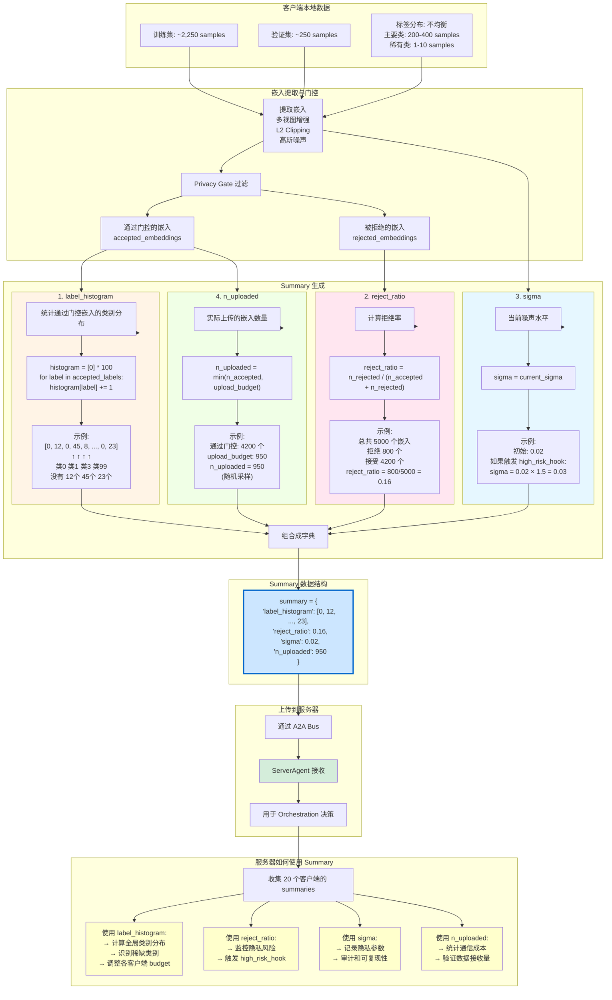

# Client Summary 生成与上传流程图

## 核心功能

**每个客户端向服务器报告本轮的数据统计信息，用于服务器做决策**

---

## Mermaid 流程图



---

## Summary 详细说明

### 数据结构

```python
summary = {
    "label_histogram": List[int],    # 长度 100，每个元素是该类的样本数
    "reject_ratio": float,           # 0.0 ~ 1.0，拒绝率
    "sigma": float,                  # 当前噪声水平
    "n_uploaded": int                # 实际上传的嵌入数量
}
```

---

### 字段 1: label_histogram

**作用**: 告诉服务器"我有哪些类别的数据"

**生成方式**:
```python
label_histogram = [0] * n_classes  # 初始化 100 个 0
for label in accepted_labels:
    label_histogram[label] += 1
```

**示例**:
```python
# 客户端 5 上传的 label_histogram
[0, 12, 0, 45, 8, 0, 0, 67, ..., 0, 23, 0, 15]
 ↑   ↑     ↑   ↑              ↑   ↑
类0 类1   类3 类4            类98 类99

解读:
- 类 0: 0 个样本（这个客户端没有类 0 的数据）
- 类 1: 12 个样本
- 类 3: 45 个样本
- 类 7: 67 个样本（主要类别）
- ...
- 类 99: 15 个样本
```

**服务器如何使用**:
```python
# 收集所有客户端的 histogram
global_hist = np.zeros(100)
for summary in summaries:  # 20 个客户端
    global_hist += np.array(summary["label_histogram"])

# 示例: global_hist
# [45, 230, 12, 890, 156, ..., 234, 450]
#        ↑          ↑                 ↑
#      类1少     类3多             类99多

# 识别稀缺类别
target = global_hist.sum() / 100  # 平均每类应该有多少
label_gap = target - global_hist   # 缺口

# 奖励持有稀缺类的客户端
# 如果客户端 5 有很多类 1 的数据（稀缺类）
# → 增加它的 upload_budget
```

---

### 字段 2: reject_ratio

**作用**: 报告本轮的隐私风险水平

**生成方式**:
```python
n_total = n_accepted + n_rejected
reject_ratio = n_rejected / n_total
```

**示例**:
```python
# 某客户端某轮的统计
总嵌入数: 5000 (训练集 2500 × 2 views)
通过 Privacy Gate: 4200
被拒绝: 800
reject_ratio = 800 / 5000 = 0.16
```

**服务器如何使用**:
```python
# 监控所有客户端的平均拒绝率
avg_reject_ratio = np.mean([s["reject_ratio"] for s in summaries])

# 触发 High-Risk Hook
if avg_reject_ratio > 0.30:
    print("⚠️ 隐私风险高！增加噪声")
    for client in clients:
        client.sigma *= 1.5
        client.upload_budget //= 2
```

**实验结果**:
```
轮次      平均拒绝率
R1-R10:   0.16
R11-R50:  0.16
R51-R100: 0.16

✅ 非常稳定，说明隐私参数设置得当
✅ 从未触发 high_risk_hook (因为 0.16 < 0.30)
```

---

### 字段 3: sigma

**作用**: 记录当前使用的噪声水平

**生成方式**:
```python
sigma = self.current_sigma  # 客户端维护的当前噪声参数
```

**示例**:
```python
# 初始值
sigma = 0.02

# 如果触发 high_risk_hook
sigma = 0.02 × 1.5 = 0.03

# 下一轮报告
summary["sigma"] = 0.03
```

**服务器如何使用**:
```python
# 监控和日志记录
avg_sigma = np.mean([s["sigma"] for s in summaries])
print(f"R{round} | AvgSigma:{avg_sigma:.4f}")

# 用于审计和可复现性
# 记录每轮每个客户端使用的隐私参数
```

**实验结果**:
```
所有 100 轮:
- sigma 始终为 0.02
- 从未变化
- 说明 high_risk_hook 从未触发
```

---

### 字段 4: n_uploaded

**作用**: 报告实际上传了多少嵌入

**生成方式**:
```python
n_accepted = len(accepted_embeddings)
n_uploaded = min(n_accepted, upload_budget)

# 如果通过门控的嵌入太多，随机采样
if n_accepted > upload_budget:
    sampled_indices = random.sample(range(n_accepted), upload_budget)
    final_embeddings = accepted_embeddings[sampled_indices]
```

**示例**:
```python
# 客户端 10, 轮次 50
通过 Privacy Gate: 4200 个嵌入
upload_budget: 950 (由服务器在上一轮分配)
n_uploaded: 950 (随机采样 950 个上传)
```

**服务器如何使用**:
```python
# 统计通信成本
total_embeddings = sum([s["n_uploaded"] for s in summaries])
comm_bytes = total_embeddings * 512 * 4  # 512-dim, float32

print(f"R{round} | Total: {total_embeddings} embs, {comm_bytes/1e6:.2f} MB")

# 验证数据接收量
expected = sum([s["n_uploaded"] for s in summaries])
received = len(merged_embeddings)
assert expected == received, "数据丢失！"
```

**实验结果**:
```
每轮每客户端平均上传: ~950 个嵌入
20 个客户端 × 950 = 19,000 个嵌入/轮
100 轮 × 19,000 = 1,900,000 个嵌入
总通信量: 1,900,000 × 512 × 4 bytes ≈ 3.66 GB
```

---

## 完整示例

### 客户端 5, 轮次 30

```python
# 1. 本地数据
train_samples = 2,500
val_samples = 250
类别分布: {1: 450, 3: 380, 7: 420, ..., 99: 15}

# 2. 嵌入提取
原始样本: 2,500
多视图 (n_views=2): 5,000
添加噪声: 5,000
Privacy Gate 过滤:
  - 接受: 4,200
  - 拒绝: 800

# 3. 采样上传
upload_budget = 972 (服务器分配)
随机采样: 972 个嵌入

# 4. 生成 Summary
summary = {
    "label_histogram": [0, 15, 0, 48, 10, 0, 0, 72, ..., 0, 20, 0, 8],
    #                      ↑类1  ↑类3  ↑类4     ↑类7      ↑类98  ↑类99
    #                     15个  48个  10个    72个      20个   8个

    "reject_ratio": 0.16,  # 800 / 5000

    "sigma": 0.02,  # 当前噪声水平

    "n_uploaded": 972  # 实际上传量
}

# 5. 上传到服务器
bus.send_task(
    sender="client_5",
    receiver="server",
    task_type="extract_embeddings",
    message=summary,
    artifacts={"embeddings": embeddings_tensor}
)
```

---

## 服务器收到 Summary 后的处理

### Step 1: 收集所有客户端的 Summaries

```python
summaries = []
for client_id in range(20):
    summary = receive_from_client(client_id)
    summaries.append(summary)

# 现在有 20 个 summary 字典
```

### Step 2: 计算全局统计

```python
# 全局类别分布
global_hist = np.zeros(100)
for s in summaries:
    global_hist += np.array(s["label_histogram"])

# 平均拒绝率
avg_reject_ratio = np.mean([s["reject_ratio"] for s in summaries])

# 平均噪声
avg_sigma = np.mean([s["sigma"] for s in summaries])

# 总上传量
total_uploaded = sum([s["n_uploaded"] for s in summaries])
```

### Step 3: Orchestration 决策

```python
# 识别稀缺类别
target = global_hist.sum() / 100
label_gap = np.clip(target - global_hist, 0, None)
label_gap_norm = label_gap / (label_gap.sum() + 1e-8)

# 计算每个客户端的稀缺性得分
for i, summary in enumerate(summaries):
    client_hist = np.array(summary["label_histogram"])
    client_classes = np.where(client_hist > 0)[0]
    rarity_score = label_gap_norm[client_classes].sum()

    # 调整 budget
    new_budget = int(500 * (1 + rarity_score))
    instructions[i] = {"upload_budget": new_budget}
```

### Step 4: 发送指令

```python
for client_id, instruction in enumerate(instructions):
    bus.send_task(
        sender="server",
        receiver=f"client_{client_id}",
        task_type="apply_instructions",
        message=instruction
    )
```

---

## 通信流程图

```
Round R 开始
    ↓
┌─────────────────────────────────────┐
│ Client 0                            │
│   生成 summary_0                    │
│   上传 972 个嵌入                   │
└─────────────────────────────────────┘
    ↓ A2A Bus
┌─────────────────────────────────────┐
│ Client 1                            │
│   生成 summary_1                    │
│   上传 950 个嵌入                   │
└─────────────────────────────────────┘
    ↓ A2A Bus
    ...
    ↓ A2A Bus
┌─────────────────────────────────────┐
│ Client 19                           │
│   生成 summary_19                   │
│   上传 965 个嵌入                   │
└─────────────────────────────────────┘
    ↓ A2A Bus
┌─────────────────────────────────────┐
│ Server                              │
│   收集 20 个 summaries              │
│   分析 label_histogram              │
│   检查 reject_ratio                 │
│   计算 rarity_score                 │
│   生成新指令                        │
└─────────────────────────────────────┘
    ↓ A2A Bus
┌─────────────────────────────────────┐
│ 所有 Clients                        │
│   接收新的 upload_budget            │
│   准备下一轮                        │
└─────────────────────────────────────┘
    ↓
Round R+1 开始
```

---

## 总结

### Summary 的四个字段

| 字段 | 类型 | 作用 | 服务器如何使用 |
|------|------|------|----------------|
| **label_histogram** | List[int] | 类别分布 | 识别稀缺类，分配 budget |
| **reject_ratio** | float | 拒绝率 | 监控隐私风险，触发 hook |
| **sigma** | float | 噪声水平 | 审计日志，可复现性 |
| **n_uploaded** | int | 上传量 | 统计通信成本，验证接收 |

### 关键特点

✅ **轻量级**: 每个 summary 只有 ~500 字节
- label_histogram: 100 × 4 bytes = 400 bytes
- reject_ratio: 8 bytes
- sigma: 8 bytes
- n_uploaded: 8 bytes

✅ **信息丰富**: 足够服务器做 Orchestration 决策

✅ **隐私友好**: 不泄露原始数据，只有统计信息

✅ **高效通信**:
```
嵌入数据: ~950 × 512 × 4 = ~1.95 MB
Summary: ~500 bytes
占比: 0.025%（几乎可忽略）
```

---

## 论文写作建议

### 描述 Summary 机制

```
"Each client generates a lightweight summary reporting its local
statistics, including the label distribution of uploaded embeddings
(label_histogram), the Privacy Gate rejection rate (reject_ratio),
the current noise level (sigma), and the number of uploaded embeddings
(n_uploaded).

The server leverages these summaries to orchestrate personalized
instructions. By aggregating label_histogram across clients, the
server identifies globally scarce classes and allocates higher
upload budgets to clients holding such rare data. The reject_ratio
serves as an early warning signal: if the average rejection rate
exceeds 30%, the system automatically increases noise levels and
reduces upload budgets to mitigate privacy risks.

In our experiments, summaries added negligible communication overhead
(~500 bytes per client vs. ~2 MB for embeddings), while enabling
dynamic, privacy-aware resource allocation."
```

---

## 可视化建议

这个流程图：
- ✅ 简单清晰（4个字段，逻辑直接）
- ✅ 有具体示例（每个字段都有数值例子）
- ✅ 展示了双向通信（Client → Server → Client）
- ✅ 说明了服务器如何使用这些信息

可以直接在 https://mermaid.live/ 渲染！
