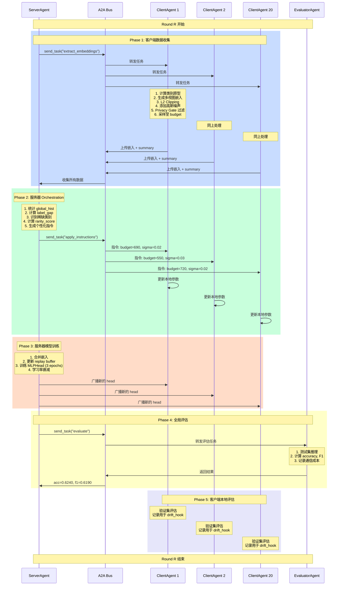
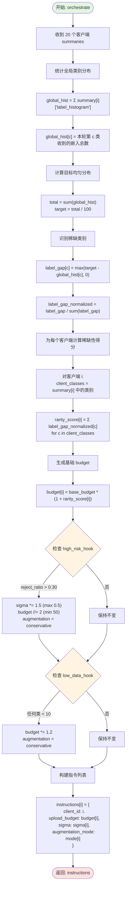
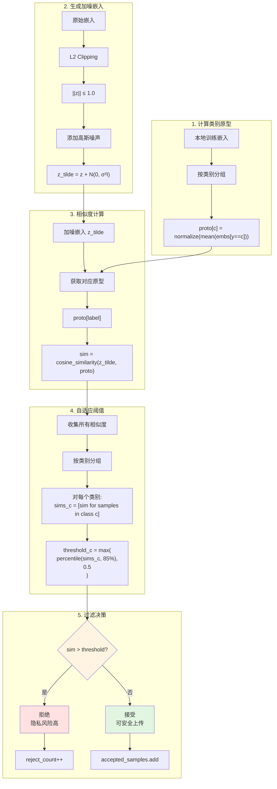
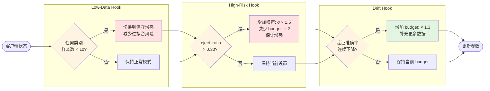
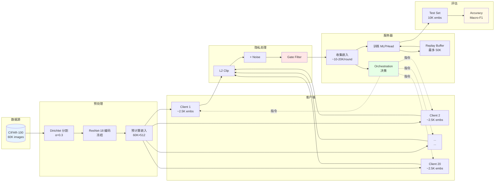

# AO-FRL 框架流程图 (Mermaid 格式)

## 1. 系统架构图

```mermaid
graph TB
    subgraph "数据层"
        D1[CIFAR-100 训练集<br/>50,000 samples]
        D2[CIFAR-100 测试集<br/>10,000 samples]
        D3[Dirichlet 分割<br/>α=0.3]
    end

    subgraph "模型层"
        M1[ResNet-18 编码器<br/>冻结参数<br/>512维输出]
        M2[MLPHead<br/>可训练<br/>512→256→100]
    end

    subgraph "Agent 层"
        A1[ServerAgent<br/>Orchestrator]
        A2[ClientAgent × 20<br/>Workers]
        A3[EvaluatorAgent<br/>Monitor]
    end

    subgraph "通信层"
        C1[A2A Bus<br/>消息路由 + 审计日志]
    end

    subgraph "隐私层"
        P1[L2 Clipping<br/>||z|| ≤ 1.0]
        P2[Gaussian Noise<br/>σ = 0.02~0.5]
        P3[Privacy Gate<br/>拒绝相似样本]
    end

    D1 --> D3
    D3 --> A2
    D2 --> A3
    M1 --> A2
    A2 --> P1
    P1 --> P2
    P2 --> P3
    P3 --> C1
    C1 --> A1
    A1 --> M2
    M2 --> A3
    A1 -.指令.-> C1
    C1 -.指令.-> A2
```

## 2. 单轮训练完整流程



## 3. 客户端嵌入提取详细流程

```mermaid
flowchart TD
    Start([开始: extract_gated_embeddings]) --> A1[从缓存读取训练嵌入]
    A1 --> A2{检查 augmentation_mode}

    A2 -->|normal| A3[正常增强]
    A2 -->|conservative| A4[保守增强<br/>更少变换]

    A3 --> B1[计算类别原型]
    A4 --> B1

    B1 --> B2["对每个类别 c:<br/>proto[c] = normalize(mean(embs[y==c]))"]
    B2 --> C1[生成多视图嵌入]

    C1 --> C2["view 1: embs + randn*0.01"]
    C1 --> C3["view 2: embs + randn*0.02"]

    C2 --> D1[L2 Clipping]
    C3 --> D1

    D1 --> D2["||z|| > C ? z = z * C/||z|| : z"]
    D2 --> E1[添加高斯噪声]

    E1 --> E2["z_tilde = z + N(0, σ²I)"]
    E2 --> F1[计算与原型相似度]

    F1 --> F2["对每个样本:<br/>sim = cosine_similarity(z_tilde, proto[label])"]
    F2 --> G1[Privacy Gate 判断]

    G1 --> G2["按类别计算 threshold:<br/>threshold = max(percentile(sims, 85%), 0.5)"]
    G2 --> G3{sim > threshold?}

    G3 -->|是| H1[拒绝样本]
    G3 -->|否| H2[接受样本]

    H1 --> I1[计算 reject_ratio]
    H2 --> I1

    I1 --> J1[从接受的样本中采样]
    J1 --> J2["采样至 upload_budget 个"]

    J2 --> K1[应用自适应钩子]

    K1 --> K2{low_data_hook<br/>任何类 < 10?}
    K2 -->|是| K3[augmentation_mode = conservative]
    K2 -->|否| K4[保持不变]

    K3 --> L1{high_risk_hook<br/>reject_ratio > 0.30?}
    K4 --> L1

    L1 -->|是| L2["sigma *= 1.5 (max 0.5)<br/>budget //= 2 (min 50)"]
    L1 -->|否| L3[保持不变]

    L2 --> M1{drift_hook<br/>验证准确率下降?}
    L3 --> M1

    M1 -->|是| M2[budget *= 1.3]
    M1 -->|否| M3[保持不变]

    M2 --> N1[生成 summary]
    M3 --> N1

    N1 --> N2["summary = {<br/>  label_histogram,<br/>  reject_ratio,<br/>  sigma,<br/>  n_uploaded<br/>}"]

    N2 --> End([返回: embeddings, labels, summary])

    style Start fill:#e1f5e1
    style End fill:#ffe1e1
    style G3 fill:#fff4e1
    style K2 fill:#fff4e1
    style L1 fill:#fff4e1
    style M1 fill:#fff4e1
```



## 4. 服务器 Orchestration 详细流程



## 5. Privacy Gate 详细机制



## 6. 三个自适应钩子



## 7. 对比三种方法的流程

```mermaid
graph TB
    subgraph "Centralized (上界)"
        C1[全部 50K 样本] --> C2[训练 MLP]
        C2 --> C3[50 epochs]
        C3 --> C4[准确率: 65.54%]
        C5[通信: 0 GB]
        C6[隐私: 无保护]
    end

    subgraph "FedAvg (基线)"
        F1[20 个客户端] --> F2[本地训练 MLP]
        F2 --> F3[每轮 3 local_epochs]
        F3 --> F4[上传参数 ~0.63MB]
        F4 --> F5[服务器聚合参数]
        F5 --> F6[100 rounds]
        F6 --> F7[准确率: 51.45%]
        F8[通信: 2.52 GB]
        F9[隐私: 无保护]
    end

    subgraph "AO-FRL (提出方法)"
        A1[20 个客户端] --> A2[提取嵌入]
        A2 --> A3[三重隐私保护]
        A3 --> A4[Privacy Gate 过滤]
        A4 --> A5[上传嵌入 ~1MB]
        A5 --> A6[服务器 Orchestration]
        A6 --> A7[训练 MLP 3 epochs]
        A7 --> A8[100 rounds]
        A8 --> A9[准确率: 61.91%]
        A10[通信: 5.22 GB]
        A11[隐私: 三重保护]
    end

    style C4 fill:#90EE90
    style F7 fill:#FFB6C6
    style A9 fill:#87CEEB
```



## 8. 数据流向图



## 使用说明

### 在线工具
1. **Mermaid Live Editor**: https://mermaid.live/
   - 复制上面的代码块
   - 粘贴到编辑器
   - 自动生成流程图
   - 可导出 PNG/SVG

2. **VS Code** (安装 Mermaid 插件):
   - 安装 "Markdown Preview Mermaid Support"
   - 预览 .md 文件即可看到图表

3. **Notion/GitHub**:
   - 直接粘贴 mermaid 代码块
   - 自动渲染

### 建议
- **图 1 (系统架构)**: 用于论文的 Overview/Framework 部分
- **图 2 (单轮流程)**: 用于详细解释算法执行
- **图 3 (嵌入提取)**: 用于解释客户端隐私保护
- **图 4 (Orchestration)**: 用于解释服务器决策
- **图 5 (Privacy Gate)**: 用于解释隐私机制
- **图 7 (三方法对比)**: 用于 Related Work 或 Experiments
- **图 8 (数据流)**: 用于补充说明数据处理流程
