# Hooks 触发机制详解

## 核心问题

**三个 Hooks 是在 Client 端还是 Server 端触发？**

答案：**两端都有，但机制不同！**

---

## 🔍 代码分析

### Client 端实现

```python
# 位置: run_experiment.py:321-337
class ProposedClient:
    def _apply_hooks(self, reject_ratio):
        # Hook 1: Low-Data Hook
        k = self.cfg.get("low_data_k", 10)
        if (self.label_counts[self.label_counts > 0] < k).any():
            self.augmentation_mode = "conservative"

        # Hook 2: High-Risk Hook
        r = self.cfg.get("high_risk_r", 0.30)
        if reject_ratio > r:
            self.sigma = min(self.sigma * 1.5, 0.5)
            self.upload_budget = max(self.upload_budget // 2, 50)

        # Hook 3: Drift Hook
        if len(self.prev_val_accs) >= 2:
            if all(self.prev_val_accs[-i] < self.prev_val_accs[-i - 1]
                   for i in range(1, min(3, len(self.prev_val_accs)))):
                self.upload_budget = int(self.upload_budget * 1.3)
```

**调用时机**: 在 `extract_gated_embeddings()` 方法的**最后**
```python
# run_experiment.py:292
# 采样完成后
all_z, all_y = [], []
for idx in sorted(accepted_indices):
    # ... 采样逻辑
    if len(all_z) >= self.upload_budget:  # 用当前 budget
        break

# 采样完成后才调用 hooks
self._apply_hooks(reject_ratio)  # ← 修改 self.upload_budget, self.sigma
```

---

### Server 端实现

```python
# 位置: agents/server_agent.py:154-208
class ServerAgent:
    def orchestrate(self, summaries: list) -> list:
        # ... 计算 rarity_score

        # 默认
        aug_mode = "normal"
        new_sigma = sigma

        # Hook 1: High-Risk Hook
        if reject_ratio > self.cfg.get("high_risk_r", 0.30):
            new_sigma = min(sigma * 1.5, 0.5)
            budget = max(budget // 2, 50)
            aug_mode = "conservative"

        # Hook 2: Low-Data Hook
        low_k = self.cfg.get("low_data_k", 10)
        has_low = any(hist[c] < low_k and hist[c] > 0
                      for c in range(self.n_classes))
        if has_low:
            budget = int(budget * 1.2)
            aug_mode = "conservative"

        # 生成指令
        instructions.append({
            "upload_budget": budget,
            "sigma": new_sigma,
            "augmentation_mode": aug_mode,
        })

        return instructions
```

**调用时机**: 每轮收集完所有 summaries 后

---

## ⏱️ 执行时序图

```mermaid
sequenceDiagram
    participant C as Client 5
    participant S as Server

    Note over C,S: Round R 开始

    rect rgb(255, 248, 220)
        Note right of C: 阶段1: Client 提取嵌入
        C->>C: extract_gated_embeddings()
        Note right of C: 使用当前参数:<br/>budget=950, sigma=0.02
        C->>C: 生成多视图 (n_views=2)
        C->>C: 添加噪声 (sigma=0.02)
        C->>C: Privacy Gate 过滤
        Note right of C: 接受: 3,780<br/>拒绝: 720<br/>reject_ratio = 0.16
        C->>C: 采样至 budget (950个)
        Note right of C: ⚠️ 采样已完成!
    end

    rect rgb(255, 230, 230)
        Note right of C: 阶段2: Client 端 Hooks
        C->>C: _apply_hooks(reject_ratio=0.16)
        Note right of C: Low-Data Hook 检查:<br/>✓ 类1有8个 < 10<br/>→ aug_mode = conservative
        Note right of C: High-Risk Hook 检查:<br/>✗ 0.16 < 0.30<br/>→ 不触发
        Note right of C: Drift Hook 检查:<br/>✓ 连续下降<br/>→ budget *= 1.3 = 1,235
        Note right of C: 修改后的参数:<br/>budget=1,235 ← 新值<br/>sigma=0.02<br/>aug_mode=conservative
    end

    rect rgb(230, 248, 255)
        Note right of C: 阶段3: 上传数据
        C->>S: 上传 950 个嵌入
        C->>S: 上传 summary {<br/>  reject_ratio: 0.16,<br/>  n_uploaded: 950,<br/>  ...<br/>}
    end

    rect rgb(230, 255, 230)
        Note over S: 阶段4: Server Orchestration
        S->>S: 收集 20 个 summaries
        S->>S: orchestrate(summaries)
        Note left of S: 计算 rarity_score = 0.32
        Note left of S: base_budget = 500 × 1.32 = 660
        Note left of S: Low-Data Hook 检查:<br/>✓ 类1有8个 < 10<br/>→ budget *= 1.2 = 792<br/>→ aug_mode = conservative
        Note left of S: High-Risk Hook 检查:<br/>✗ 0.16 < 0.30<br/>→ 不触发
        Note left of S: 生成指令:<br/>budget=792<br/>sigma=0.02<br/>aug_mode=conservative
    end

    rect rgb(255, 230, 255)
        Note over S: 阶段5: 发送指令
        S->>C: apply_instructions({<br/>  budget: 792,<br/>  sigma: 0.02,<br/>  aug_mode: conservative<br/>})
    end

    rect rgb(255, 200, 200)
        Note right of C: ⚠️ 阶段6: Client 应用指令
        C->>C: apply_server_instructions()
        Note right of C: 覆盖之前的值!<br/>budget: 1,235 → 792<br/>sigma: 0.02 → 0.02<br/>aug_mode: conservative → conservative
        Note right of C: Client 端 Drift Hook<br/>的 budget 调整被覆盖!
    end

    Note over C,S: Round R+1 开始
    Note right of C: 使用新参数:<br/>budget=792 (Server决定)<br/>sigma=0.02<br/>aug_mode=conservative
```



---

## 💡 关键发现

### 1. 双重实现的原因

看起来有两套 Hook 系统：

| Hook | Client 端 | Server 端 |
|------|-----------|----------|
| **Low-Data Hook** | ✅ 有 | ✅ 有 |
| **High-Risk Hook** | ✅ 有 | ✅ 有 |
| **Drift Hook** | ✅ 有 | ❌ **无** |

---

### 2. 执行顺序

```
1. Client 提取嵌入 (用 Round R 的参数)
2. Client 采样至 budget
3. Client 调用 _apply_hooks() → 修改 self.budget, self.sigma
   ⚠️ 这些修改准备用于 Round R+1
4. Client 上传数据
5. Server orchestrate() → 生成新指令
6. Server 发送指令给 Client
7. Client apply_server_instructions() → 覆盖步骤3的修改
   ⚠️ Server 的指令覆盖了 Client 的 hooks 调整!
```

---

### 3. 谁真正起作用？

**答案：Server 端的 Hooks 生效，Client 端的被覆盖！**

#### Low-Data Hook
```
Client 端: 检测到 → aug_mode = conservative
Server 端: 检测到 → aug_mode = conservative
最终: Server 指令覆盖，但结果相同 ✓
```

#### High-Risk Hook
```
Client 端: 未触发 (0.16 < 0.30)
Server 端: 未触发 (0.16 < 0.30)
最终: 都不触发 ✓
```

#### Drift Hook ⚠️
```
Client 端: 触发! budget *= 1.3 → 1,235
Server 端: 没有这个 Hook!
最终: Server 发送 budget=792 → 覆盖 Client 的 1,235
      Client 的 Drift Hook 被无效化! ✗
```

---

## 🚨 问题：Drift Hook 被覆盖

### 代码证据

**Client 端有 Drift Hook**:
```python
# run_experiment.py:333-337
if len(self.prev_val_accs) >= 2:
    if all(self.prev_val_accs[-i] < self.prev_val_accs[-i - 1]
           for i in range(1, min(3, len(self.prev_val_accs)))):
        self.upload_budget = int(self.upload_budget * 1.3)  # ← 调整 budget
```

**Server 端没有 Drift Hook**:
```python
# server_agent.py:154-208
def orchestrate(self, summaries: list) -> list:
    # ... 只有 High-Risk 和 Low-Data Hook
    # 没有检查 prev_val_accs 或连续下降!
```

**Server 覆盖 Client**:
```python
# run_experiment.py:707
clients[cid].apply_server_instructions(instr)

# run_experiment.py:352-358
def apply_server_instructions(self, instructions):
    self.upload_budget = instructions.get("upload_budget", self.upload_budget)
    # ← 直接覆盖!
```

---

### 实验数据验证

从 `hooks_analysis_report.md`:

```
Drift Hook 检测到连续下降:
- R30: 0.6198 < 0.6221 ✓
- R60: 0.6160 < 0.6205 ✓

但 Budget 变化很小:
- R29-R31: 974 → 975 → 967 (仅 +0.1%)
- R59-R61: 979 → 972 → 974 (仅 -0.7%)

预期: budget *= 1.3 → 应该增加30%
实际: 几乎不变

原因: Client 的调整被 Server 覆盖了!
```

---

## 🎯 结论

### 实际工作机制

| Hook | 判断位置 | 生效位置 | 是否有效 |
|------|---------|---------|---------|
| **Low-Data Hook** | ✅ Client & Server | Server | ✅ 有效 |
| **High-Risk Hook** | ✅ Client & Server | Server | ✅ 有效 |
| **Drift Hook** | ✅ Client only | ~~Client~~ | ❌ **被覆盖** |

---

### 为什么这样设计？

#### 推测1: Drift Hook 是后期添加的

可能的开发历史：
```
1. 最初设计: Server 统一决策 (High-Risk, Low-Data)
2. 后期想法: Client 应该根据自己的验证结果调整 (Drift)
3. 实现: 在 Client 端添加了 _apply_hooks() 包含所有三个
4. 问题: 忘记在 Server 端也实现 Drift Hook
5. 结果: Drift Hook 被 Server 指令覆盖
```

#### 推测2: 故意设计成 Server 主导

可能是想让 Server 有最终决定权：
```
Client: 提供建议性调整
Server: 综合所有 Client 信息后做最终决策
```

但如果是这样，Drift Hook 应该包含在 summary 中传给 Server。

---

## 🔧 修复建议

### 方案1: 在 Server 端实现 Drift Hook

```python
# server_agent.py orchestrate() 方法中
def orchestrate(self, summaries: list) -> list:
    # ... 现有逻辑

    for s in summaries:
        # 新增: 检查 Client 的验证准确率
        val_acc = s.get("local_val_acc", None)

        if val_acc is not None:
            # 从之前的 summary 中获取历史准确率
            prev_accs = self.client_val_history.get(s["client_id"], [])

            # Drift Hook 检查
            if len(prev_accs) >= 2:
                if val_acc < prev_accs[-1] < prev_accs[-2]:
                    budget = int(budget * 1.3)

            # 更新历史
            prev_accs.append(val_acc)
            self.client_val_history[s["client_id"]] = prev_accs
```

---

### 方案2: 让 Client 的 Drift Hook 优先

```python
# run_experiment.py apply_server_instructions()
def apply_server_instructions(self, instructions):
    # 保存 Client 的 Drift Hook 调整
    drift_adjusted_budget = self.upload_budget

    # 应用 Server 指令
    server_budget = instructions.get("upload_budget", self.upload_budget)

    # 取较大值 (保留 Drift Hook 的增加)
    self.upload_budget = max(drift_adjusted_budget, server_budget)

    # 其他参数正常覆盖
    self.sigma = instructions.get("sigma", self.sigma)
    self.augmentation_mode = instructions.get("augmentation_mode",
                                               self.augmentation_mode)
```

---

### 方案3: 完全移除 Client 端的 Hooks

```python
# 删除 run_experiment.py:321-337 的 _apply_hooks()
# 所有 Hook 逻辑只在 Server 端

# 优点: 统一决策，避免冲突
# 缺点: Server 需要更多信息 (如 local_val_acc)
```

---

## 📊 当前实验的真实情况

### Low-Data Hook
✅ **Server 端生效**
```
所有 100 轮: 20/20 客户端使用 conservative
原因: Server 检测到所有客户端都有 < 10 样本的类
```

### High-Risk Hook
❌ **未触发**
```
所有 100 轮: reject_ratio = 0.16 < 0.30
Client 和 Server 都未触发
```

### Drift Hook
⚠️ **Client 端触发但被覆盖**
```
R30, R60: Client 检测到连续下降 → budget *= 1.3
但 Server 的指令覆盖了这个调整
实际 budget 变化: < 1% (几乎无影响)
```

---

## 🎓 论文写作建议

### 如实描述

```
"We implement adaptive hooks at both the client and server levels:

1. Server-side hooks (Low-Data, High-Risk) analyze global statistics
   from all clients to generate personalized instructions.

2. Client-side hooks (Drift) monitor local validation performance to
   detect model degradation.

In practice, server-side instructions take priority to ensure global
coordination. The Drift hook, while implemented on the client side,
has minimal impact in our experiments due to the dominance of
server-side orchestration and the stability of the training process
(validation accuracy remained within 61.6-62.5% throughout)."
```

---

### 或者修复后描述

如果修复了 Drift Hook:

```
"We implement a hierarchical adaptive system:

1. Server-side orchestration adjusts upload budgets based on data
   rarity (Low-Data hook) and privacy risks (High-Risk hook).

2. Client-side drift detection monitors local validation accuracy.
   When consecutive drops are detected, clients request increased
   upload budgets (×1.3) to provide more data for model recovery.

3. The server integrates both global rarity scores and client-specific
   drift signals to generate final instructions, ensuring both
   fair resource allocation and responsive adaptation."
```

---

## 总结

### 直接回答你的问题

**三个 Hooks 在哪里触发？**

| Hook | 判断位置 | 实际生效 |
|------|---------|---------|
| **Low-Data Hook** | Client & Server | **Server** |
| **High-Risk Hook** | Client & Server | **Server** |
| **Drift Hook** | Client only | **被覆盖** (几乎无效) |

**为什么？**
- Client 的 `_apply_hooks()` 在提取嵌入后调用，修改参数
- 但 Server 的 `orchestrate()` 生成的指令会覆盖 Client 的修改
- 最终参数由 **Server 决定**

**影响？**
- Low-Data & High-Risk: 正常工作（Server 判断）
- Drift Hook: **基本无效**（Client 判断但被覆盖）

**建议？**
- 修复: 在 Server 端也实现 Drift Hook
- 或者: 修改覆盖逻辑，保留 Client 的 Drift 调整
