# Server Agent 决策流程详解

## 核心职责

**ServerAgent 是联邦学习的"大脑"，负责：**
1. 收集客户端数据（embeddings + summaries）
2. 训练全局模型
3. 分析全局状态
4. 生成个性化指令
5. 分发模型和指令

---

## 完整流程图

```mermaid
flowchart TB
    subgraph Round["单轮训练流程 (Round R)"]
        direction TB

        START["🎬 轮次 R 开始"]

        subgraph Phase1["阶段1: 收集数据 (Collection)"]
            direction TB

            SEND_REQ["服务器向20个客户端<br/>发送提取任务<br/>━━━━━━━━━━━━━━━━━━<br/>A2A Task: extract_embeddings<br/>{round: R, n_views: 2}"]

            subgraph ClientWork["客户端并行工作"]
                C1["Client 0<br/>提取 & 门控"]
                C2["Client 1<br/>提取 & 门控"]
                C3["..."]
                C4["Client 19<br/>提取 & 门控"]
            end

            COLLECT["服务器收集返回结果<br/>━━━━━━━━━━━━━━━━━━<br/>20 × {<br/>  embeddings: (950, 512)<br/>  summary: {<br/>    label_histogram,<br/>    reject_ratio,<br/>    sigma,<br/>    n_uploaded<br/>  }<br/>}"]

            MERGE["合并所有嵌入<br/>━━━━━━━━━━━━━━━━━━<br/>merged_embeddings:<br/>  shape = (19,000, 512)<br/>merged_labels:<br/>  shape = (19,000,)"]
        end

        subgraph Phase2["阶段2: 训练模型 (Training)"]
            direction TB

            REPLAY["📦 Replay Buffer<br/>━━━━━━━━━━━━━━━━━━<br/>累积历史数据<br/>(最多50,000个嵌入)<br/><br/>当前轮: 19,000 新数据<br/>历史: 31,000 旧数据<br/>总计: 50,000"]

            WEIGHT["⚖️ 样本加权<br/>━━━━━━━━━━━━━━━━━━<br/>weight = decay^age<br/>decay = 0.995<br/><br/>轮次R的数据: weight = 1.0<br/>轮次R-1: weight = 0.995<br/>轮次R-10: weight = 0.951<br/>轮次R-50: weight = 0.779"]

            TRAIN["🔧 训练 MLPHead<br/>━━━━━━━━━━━━━━━━━━<br/>Epochs: 3<br/>Batch Size: 256<br/>Optimizer: Adam<br/>LR: 0.001 × 0.98^(R-1)<br/><br/>使用加权采样<br/>新数据更重要"]

            UPDATE["✅ 更新全局模型<br/>━━━━━━━━━━━━━━━━━━<br/>self.head ← 训练后的参数"]
        end

        subgraph Phase3["阶段3: 分析与决策 (Orchestration)"]
            direction TB

            ANALYZE["📊 分析全局状态<br/>━━━━━━━━━━━━━━━━━━"]

            subgraph Analysis["详细分析"]
                direction TB

                A1["1️⃣ 计算全局类别分布<br/>━━━━━━━━━━━━━━━━━━<br/>global_hist = Σ(all label_histograms)<br/><br/>示例:<br/>[180, 450, 89, 890, ...]<br/>  ↑    ↑   ↑    ↑<br/> 类0 类1 类2  类3<br/> 少  充足 稀缺 过多"]

                A2["2️⃣ 识别稀缺类别<br/>━━━━━━━━━━━━━━━━━━<br/>target = 19,000 / 100 = 190<br/><br/>label_gap = max(0, target - global_hist)<br/><br/>类0: 190-180 = 10 (稍缺)<br/>类1: 190-450 = 0 (充足)<br/>类2: 190-89 = 101 (稀缺!)<br/>类3: 190-890 = 0 (过多)"]

                A3["3️⃣ 归一化稀缺性<br/>━━━━━━━━━━━━━━━━━━<br/>label_gap_norm = <br/>  label_gap / sum(label_gap)<br/><br/>[0.09, 0.00, 0.91, 0.00, ...]<br/>  ↑           ↑<br/> 类0稍缺    类2非常稀缺"]
            end

            DECISION["🎯 生成个性化指令<br/>━━━━━━━━━━━━━━━━━━<br/>遍历20个客户端<br/>为每个客户端计算指令"]

            subgraph ClientDecision["单个客户端决策 (Client 5)"]
                direction TB

                D1["输入: Client 5 的 summary<br/>━━━━━━━━━━━━━━━━━━<br/>label_histogram: [0,8,0,42,15,...]<br/>reject_ratio: 0.16<br/>sigma: 0.02"]

                D2["计算稀缺性得分<br/>━━━━━━━━━━━━━━━━━━<br/>client_classes = [1,3,4,5,...] (45个类)<br/><br/>rarity_score = <br/>  Σ label_gap_norm[client_classes]<br/>= 0.00 + 0.00 + 0.15 + ... = 0.32<br/><br/>含义: 客户端5持有一些稀缺类"]

                D3["基础预算分配<br/>━━━━━━━━━━━━━━━━━━<br/>base_budget = 500<br/><br/>budget = base_budget × (1 + rarity_score)<br/>       = 500 × 1.32<br/>       = 660"]

                D4["检查并应用 Hooks<br/>━━━━━━━━━━━━━━━━━━"]

                subgraph Hooks["三个自适应钩子"]
                    H1["🔴 High-Risk Hook<br/>━━━━━━━━━━━━━━━━━━<br/>if reject_ratio > 0.30:<br/>  sigma *= 1.5<br/>  budget //= 2<br/>  aug_mode = conservative<br/><br/>状态: ❌ 未触发<br/>(0.16 < 0.30)"]

                    H2["🟡 Low-Data Hook<br/>━━━━━━━━━━━━━━━━━━<br/>if any(class_count < 10):<br/>  budget *= 1.2<br/>  aug_mode = conservative<br/><br/>状态: ✅ 触发!<br/>(类1只有8个样本)<br/>budget = 660 × 1.2 = 792"]

                    H3["🟢 Drift Hook<br/>━━━━━━━━━━━━━━━━━━<br/>if val_acc连续下降:<br/>  budget *= 1.3<br/><br/>状态: ⚠️ 在Client端判断<br/>(Server不直接触发)"]
                end

                D5["生成最终指令<br/>━━━━━━━━━━━━━━━━━━<br/>instruction = {<br/>  client_id: 5,<br/>  upload_budget: 792,<br/>  sigma: 0.02,<br/>  augmentation_mode: conservative<br/>}"]
            end

            INSTRUCTIONS["📋 收集所有指令<br/>━━━━━━━━━━━━━━━━━━<br/>20 个客户端的指令列表<br/><br/>Client 0: budget=820, sigma=0.02<br/>Client 5: budget=792, sigma=0.02<br/>Client 12: budget=650, sigma=0.02<br/>..."]
        end

        subgraph Phase4["阶段4: 分发 (Distribution)"]
            direction TB

            BROADCAST["📡 广播全局模型<br/>━━━━━━━━━━━━━━━━━━<br/>将训练好的 MLPHead<br/>发送给所有客户端<br/><br/>参数量: ~157K<br/>大小: 628 KB × 20 = 12.56 MB"]

            SEND_INSTR["📤 发送个性化指令<br/>━━━━━━━━━━━━━━━━━━<br/>每个客户端收到定制指令<br/><br/>A2A Task: apply_instructions<br/><br/>Client 0 ← {budget: 820, ...}<br/>Client 5 ← {budget: 792, ...}<br/>..."]

            CLIENT_UPDATE["客户端更新本地状态<br/>━━━━━━━━━━━━━━━━━━<br/>• 下载新的全局模型<br/>• 应用服务器指令<br/>• 更新 budget, sigma, aug_mode<br/>• 准备下一轮"]
        end

        subgraph Phase5["阶段5: 评估 (Evaluation)"]
            direction TB

            EVAL_REQ["请求全局评估<br/>━━━━━━━━━━━━━━━━━━<br/>A2A Task → Evaluator<br/>evaluate(head, round)"]

            EVAL_RUN["EvaluatorAgent<br/>在测试集上评估<br/>━━━━━━━━━━━━━━━━━━<br/>10,000 测试样本<br/>计算 Accuracy & F1"]

            EVAL_RESULT["📈 返回结果<br/>━━━━━━━━━━━━━━━━━━<br/>Round R:<br/>  Accuracy: 0.6191<br/>  F1: 0.6153<br/>  Comm: 52.2 MB"]

            LOG["📝 记录日志<br/>━━━━━━━━━━━━━━━━━━<br/>[AO-FRL] R30 | Acc:0.6191<br/>F1:0.6153 Comm:1526.4MB<br/>Up:19400 Rej:0.16<br/>AvgBudget:970 AvgSigma:0.02<br/>Conservative:20/20"]
        end

        END["✅ 轮次 R 完成<br/>━━━━━━━━━━━━━━━━━━<br/>准备下一轮 R+1"]
    end

    %% 连接流程
    START --> SEND_REQ

    SEND_REQ --> ClientWork
    ClientWork --> C1 & C2 & C3 & C4
    C1 & C2 & C3 & C4 --> COLLECT

    COLLECT --> MERGE

    MERGE --> REPLAY --> WEIGHT --> TRAIN --> UPDATE

    UPDATE --> ANALYZE --> Analysis
    Analysis --> A1 --> A2 --> A3

    A3 --> DECISION --> ClientDecision

    ClientDecision --> D1 --> D2 --> D3 --> D4
    D4 --> Hooks
    Hooks --> H1 & H2 & H3
    H1 & H2 & H3 --> D5

    D5 --> INSTRUCTIONS

    INSTRUCTIONS --> BROADCAST
    BROADCAST --> SEND_INSTR
    SEND_INSTR --> CLIENT_UPDATE

    CLIENT_UPDATE --> EVAL_REQ --> EVAL_RUN --> EVAL_RESULT --> LOG

    LOG --> END

    %% 样式
    style START fill:#e3f2fd,stroke:#2196f3,stroke-width:3px
    style END fill:#e8f5e9,stroke:#4caf50,stroke-width:3px
    style MERGE fill:#fff9c4
    style TRAIN fill:#f3e5f5,stroke:#9c27b0,stroke-width:2px
    style DECISION fill:#ffe0b2,stroke:#ff9800,stroke-width:2px
    style D5 fill:#c8e6c9,stroke:#4caf50,stroke-width:2px
    style H1 fill:#ffcdd2
    style H2 fill:#fff9c4
    style H3 fill:#c8e6c9
    style EVAL_RESULT fill:#e1f5fe
```



---

## 详细步骤说明

### 阶段1: 收集数据 (Collection Phase)

#### 步骤 1.1: 服务器发送任务请求

```python
# 代码位置: run_experiment.py:663-669
for c in clients:
    # 通过 A2A Bus 发送任务
    task = bus.send_task(
        sender="server",
        receiver=f"client_{c.id}",
        task_type="extract_embeddings",
        message={"round": rnd, "n_views": 2}
    )
```

**任务内容**:
- `round`: 当前轮次号
- `n_views`: 多视图数量（默认2）

---

#### 步骤 1.2: 客户端提取与门控

每个客户端独立执行：
```python
embeddings, labels, summary = client.extract_gated_embeddings(n_views=2)
```

**返回结果**:
```python
embeddings: (950, 512)  # 通过门控的嵌入
labels: (950,)          # 对应标签
summary: {
    "client_id": 5,
    "label_histogram": [0,8,0,42,15,...],
    "reject_ratio": 0.16,
    "sigma": 0.02,
    "n_uploaded": 950
}
```

---

#### 步骤 1.3: 服务器收集结果

```python
# 代码位置: run_experiment.py:660-683
all_embs, all_labs, summaries = [], [], []

for c in clients:
    embs, labs, summary = c.extract_gated_embeddings(n_views=2)
    all_embs.append(embs)      # 收集嵌入
    all_labs.append(labs)      # 收集标签
    summaries.append(summary)  # 收集统计信息
```

**收集结果**:
- 20 个客户端 × 950 嵌入 = 19,000 个嵌入
- 20 个 summaries

---

#### 步骤 1.4: 合并嵌入

```python
# 代码位置: run_experiment.py:690-697
merged_embs = torch.cat(all_embs)  # (19000, 512)
merged_labels = torch.cat(all_labs)  # (19000,)
```

---

### 阶段2: 训练模型 (Training Phase)

#### 核心创新: Replay Buffer

**目的**: 累积历史数据，让独立噪声相互抵消

```python
# 代码位置: server_agent.py:86-89
self._replay_embs.append(all_embeddings)  # 添加当前轮数据
self._replay_labs.append(all_labels)
self._replay_ages.append(self._current_round)  # 记录轮次

# 合并所有历史数据
buf_embs = torch.cat(self._replay_embs)    # 可能有 50,000 个
buf_labs = torch.cat(self._replay_labs)
```

**缓冲区管理**:
```python
# 如果超过最大容量 (50,000)，保留最近的数据
if buf_embs.size(0) > self._replay_max:
    buf_embs = buf_embs[-self._replay_max:]
    buf_labs = buf_labs[-self._replay_max:]
```

---

#### 样本加权策略

**目的**: 新数据更重要，旧数据也有价值

```python
# 代码位置: server_agent.py:112-115
decay = 0.995
ages = current_round - buf_rounds  # 每个样本的年龄
weights = decay ** ages            # 指数衰减
weights = torch.clamp(weights, min=0.3)  # 最低权重30%
```

**示例**:
```
当前轮次 R=50
━━━━━━━━━━━━━━━━━━━━━━━━━━━━━━━━━━
轮次  年龄  权重
━━━━━━━━━━━━━━━━━━━━━━━━━━━━━━━━━━
R50   0    0.995^0  = 1.000  (最新)
R49   1    0.995^1  = 0.995
R48   2    0.995^2  = 0.990
R40   10   0.995^10 = 0.951
R30   20   0.995^20 = 0.905
R10   40   0.995^40 = 0.819
R1    49   0.995^49 = 0.778
━━━━━━━━━━━━━━━━━━━━━━━━━━━━━━━━━━
```

**好处**:
- ✅ 新数据权重高（反映最新分布）
- ✅ 旧数据仍保留（噪声平均化）
- ✅ 避免突然遗忘

---

#### 学习率衰减

```python
# 代码位置: server_agent.py:118-121
base_lr = 0.001
lr_decay = 0.98
lr = max(base_lr * (lr_decay ** (round - 1)), 1e-4)
```

**示例**:
```
轮次   学习率
━━━━━━━━━━━━━━━━━━
R1     0.00100
R10    0.00092
R50    0.00036
R100   0.00013
```

**目的**: 后期更稳定，微调参数

---

#### 训练循环

```python
# 代码位置: server_agent.py:136-145
self.head.train()
for epoch in range(3):  # 3个epoch
    for z_batch, y_batch in loader:  # batch_size=256
        logits = self.head(z_batch)
        loss = self.loss_fn(logits, y_batch)
        optimizer.zero_grad()
        loss.backward()
        optimizer.step()
```

**训练设置**:
- Epochs: 3
- Batch Size: 256
- Optimizer: Adam
- Loss: CrossEntropyLoss
- 使用 WeightedRandomSampler（样本加权）

---

### 阶段3: 分析与决策 (Orchestration Phase)

#### 步骤 3.1: 计算全局类别分布

```python
# 代码位置: server_agent.py:158-161
global_hist = np.zeros(100)
for s in summaries:
    global_hist += np.array(s["label_histogram"])
```

**示例**:
```python
# Client 0: [0, 12, 0, 45, ...]
# Client 1: [5, 8, 0, 38, ...]
# ...
# Client 19: [2, 10, 0, 42, ...]

# 合并后
global_hist = [180, 450, 89, 890, 310, ..., 234, 450]
              ↑    ↑   ↑    ↑                ↑
            类0  类1 类2  类3              类99
            少  充足 稀缺 过多              多
```

---

#### 步骤 3.2: 识别稀缺类别

```python
# 代码位置: server_agent.py:163-166
total = global_hist.sum()  # 19,000 (总上传数)
target = total / 100       # 190 (理想每类数量)

label_gap = np.clip(target - global_hist, 0, None)
# 只关心"缺少"的，"过多"的记为0
```

**示例**:
```python
target = 190

类别  global_hist  target  label_gap
━━━━━━━━━━━━━━━━━━━━━━━━━━━━━━━━━━
0     180          190     10      (稍缺)
1     450          190     0       (充足，不缺)
2     89           190     101     (非常稀缺!)
3     890          190     0       (过多，不缺)
4     310          190     0       (充足)
...
99    450          190     0       (充足)
```

---

#### 步骤 3.3: 归一化稀缺性

```python
# 代码位置: server_agent.py:166
label_gap_sum = label_gap.sum()  # 总缺口
label_gap_normalized = label_gap / (label_gap_sum + 1e-8)
```

**目的**: 转换为概率分布，和为1

**示例**:
```python
label_gap = [10, 0, 101, 0, 15, ..., 0, 8]
total_gap = 10 + 101 + 15 + 8 + ... = 1100

label_gap_norm = [
    10/1100 = 0.009,   # 类0
    0/1100 = 0.000,    # 类1
    101/1100 = 0.092,  # 类2 (稀缺性贡献最大!)
    0/1100 = 0.000,    # 类3
    ...
]
```

---

#### 步骤 3.4: 为每个客户端计算稀缺性得分

```python
# 代码位置: server_agent.py:176-178
client_hist = summary["label_histogram"]
client_classes = np.where(client_hist > 0)[0]  # 客户端有数据的类
rarity_score = label_gap_normalized[client_classes].sum()
```

**示例: Client 5**
```python
# Client 5 的 label_histogram
[0, 8, 0, 42, 15, 6, 0, 0, 71, 3, ...]
 ↑  ↑     ↑   ↑   ↑        ↑   ↑
类0 类1   类3 类4 类5      类8 类9
无  有    有  有  有       有  有

# 客户端5有数据的类别
client_classes = [1, 3, 4, 5, 8, 9, ...]  # 45个类

# 稀缺性得分
rarity_score = label_gap_norm[1] + label_gap_norm[3] + ... + label_gap_norm[99]
             = 0.000 + 0.000 + 0.015 + ... + 0.008
             = 0.32

# 含义: 客户端5持有一些稀缺类，贡献32%的稀缺性填补
```

**不同客户端的差异**:
```
Client 5:  rarity_score = 0.32 (持有一些稀缺类)
Client 12: rarity_score = 0.08 (主要是常见类)
Client 18: rarity_score = 0.55 (大量稀缺类!)
```

---

#### 步骤 3.5: 计算基础预算

```python
# 代码位置: server_agent.py:180-181
base_budget = 500
budget = int(base_budget * (1 + rarity_score))
```

**示例**:
```
Client 5:  budget = 500 × (1 + 0.32) = 660
Client 12: budget = 500 × (1 + 0.08) = 540
Client 18: budget = 500 × (1 + 0.55) = 775
```

**逻辑**: 稀缺类越多 → budget 越高 → 多上传数据

---

#### 步骤 3.6: 应用自适应钩子

**Hook 1: High-Risk Hook**
```python
# 代码位置: server_agent.py:188-191
if reject_ratio > 0.30:
    new_sigma = min(sigma * 1.5, 0.5)  # 增加噪声
    budget = max(budget // 2, 50)      # 减少上传
    aug_mode = "conservative"           # 保守增强
```

**实验结果**: ❌ 从未触发 (reject_ratio = 0.16 < 0.30)

---

**Hook 2: Low-Data Hook**
```python
# 代码位置: server_agent.py:193-199
low_k = 10
has_low = any(hist[c] < low_k and hist[c] > 0 for c in range(100))

if has_low:
    budget = int(budget * 1.2)      # 增加20%预算
    aug_mode = "conservative"        # 保守增强
```

**实验结果**: ✅ 所有轮次都触发 (所有客户端都有 < 10 样本的类)

**示例: Client 5**
```python
# Client 5 的 histogram: [0, 8, 0, 42, ...]
#                            ↑ 类1只有8个 < 10

has_low = True
budget = 660 × 1.2 = 792
aug_mode = "conservative"
```

---

**Hook 3: Drift Hook**
```python
# 注意: Drift Hook 在客户端判断，不在服务器的 orchestrate() 中
# 客户端检测本地验证准确率连续下降，自己调整 budget
```

---

#### 步骤 3.7: 生成最终指令

```python
# 代码位置: server_agent.py:201-206
instruction = {
    "client_id": 5,
    "upload_budget": 792,
    "sigma": 0.02,
    "augmentation_mode": "conservative"
}
instructions.append(instruction)
```

**20个客户端的指令示例**:
```python
[
    {"client_id": 0, "upload_budget": 820, "sigma": 0.02, "augmentation_mode": "conservative"},
    {"client_id": 1, "upload_budget": 756, "sigma": 0.02, "augmentation_mode": "conservative"},
    ...
    {"client_id": 5, "upload_budget": 792, "sigma": 0.02, "augmentation_mode": "conservative"},
    ...
    {"client_id": 12, "upload_budget": 648, "sigma": 0.02, "augmentation_mode": "conservative"},
    ...
    {"client_id": 18, "upload_budget": 930, "sigma": 0.02, "augmentation_mode": "conservative"},
    {"client_id": 19, "upload_budget": 780, "sigma": 0.02, "augmentation_mode": "conservative"},
]
```

---

### 阶段4: 分发 (Distribution Phase)

#### 步骤 4.1: 广播全局模型

```python
# 代码位置: run_experiment.py:731-734
broadcast_bytes = server.train_head(merged_embs, merged_labs, epochs=3)
# broadcast_bytes = 157,000 params × 4 bytes = 628 KB

# 发给20个客户端
round_comm += broadcast_bytes * 20  # 12.56 MB
```

**MLPHead 参数量**:
```
Layer 1: Linear(512, 256)
  → params: 512 × 256 + 256 = 131,328

Layer 2: BatchNorm1d(256)
  → params: 256 × 2 = 512

Layer 3: Linear(256, 100)
  → params: 256 × 100 + 100 = 25,700

Total: 157,540 parameters
Size: 157,540 × 4 bytes = 630,160 bytes ≈ 628 KB
```

---

#### 步骤 4.2: 发送个性化指令

```python
# 代码位置: run_experiment.py:699-709
for instr in instructions:
    cid = instr["client_id"]
    # A2A: 发送指令
    task = bus.send_task("server", f"client_{cid}",
                        "apply_instructions", instr)

    # 客户端应用指令
    clients[cid].apply_server_instructions(instr)
```

**客户端接收**:
```python
# Client 5 收到:
{
    "upload_budget": 792,
    "sigma": 0.02,
    "augmentation_mode": "conservative"
}

# 更新本地状态
self.upload_budget = 792
self.sigma = 0.02
self.augmentation_mode = "conservative"
```

---

### 阶段5: 评估 (Evaluation Phase)

```python
# 代码位置: run_experiment.py:737-746
# 发送评估任务给 EvaluatorAgent
task = bus.send_task("server", "evaluator", "evaluate",
                    {"method": "AO-FRL", "round": rnd})

# 评估
acc, f1 = evaluator.evaluate(server.get_head(), "AO-FRL", rnd, ...)

# 记录日志
logger.info(f"[AO-FRL] R{rnd} | Acc:{acc:.4f} F1:{f1:.4f} ...")
```

---

## 关键数据流

### 上行数据流 (Client → Server)

```
每个客户端:
  Embeddings: 950 × 512 × 4 bytes = 1.95 MB
  Summary: ~500 bytes

20个客户端:
  Embeddings: 19,000 × 512 × 4 bytes = 39.0 MB
  Summaries: 20 × 500 bytes = 10 KB

单轮上行: ~39 MB
```

---

### 下行数据流 (Server → Client)

```
全局模型广播:
  单个客户端: 628 KB
  20个客户端: 628 KB × 20 = 12.56 MB

指令:
  单个客户端: ~100 bytes
  20个客户端: 100 × 20 = 2 KB

单轮下行: ~12.56 MB
```

---

### 单轮总通信

```
上行 + 下行 = 39 + 12.56 = 51.56 MB ≈ 52 MB
```

---

## 决策逻辑总结

### 核心公式

```
budget = base_budget × (1 + rarity_score) × hooks_multiplier

其中:
• base_budget = 500
• rarity_score ∈ [0, 1] (客户端稀缺类贡献)
• hooks_multiplier:
  - low_data_hook: ×1.2
  - high_risk_hook: ÷2 (未触发)
  - drift_hook: ×1.3 (客户端端判断)
```

---

### 实验中的实际 Budget 范围

```
最小: 814
最大: 1,111
平均: 937-982

基准: 500

提升: 63-122% (平均 87-96%)
```

---

## 论文写作建议

### 算法伪代码

```
Algorithm: Server Orchestration

Input:
  summaries: list of client summaries
  embeddings: collected embeddings from all clients

Output:
  trained_head: updated global model
  instructions: per-client instructions

1. // Phase 1: Training
2. replay_buffer.append(embeddings)
3. weights ← compute_age_weights(replay_buffer, decay=0.995)
4. trained_head ← train(replay_buffer, weights, epochs=3)

5. // Phase 2: Analysis
6. global_hist ← Σ summary["label_histogram"] for all summaries
7. target ← global_hist.sum() / n_classes
8. label_gap ← max(0, target - global_hist)
9. label_gap_norm ← label_gap / label_gap.sum()

10. // Phase 3: Decision
11. instructions ← []
12. For each summary in summaries:
13.     client_classes ← classes where summary["label_histogram"] > 0
14.     rarity_score ← Σ label_gap_norm[client_classes]
15.     budget ← base_budget × (1 + rarity_score)
16.
17.     // Apply hooks
18.     If summary["reject_ratio"] > 0.30:
19.         budget ← budget / 2
20.         sigma ← sigma × 1.5
21.
22.     If any class has < 10 samples:
23.         budget ← budget × 1.2
24.         augmentation ← "conservative"
25.
26.     instructions.append({budget, sigma, augmentation})

27. Return trained_head, instructions
```

---

## 可视化建议

建议画以下几张图来展示这个流程：

### 图1: 单轮完整流程时序图
- 展示5个阶段的先后顺序
- 标注数据流向和大小

### 图2: Rarity Score 计算示意图
- 展示从 global_hist → label_gap → rarity_score 的计算过程
- 用具体数字示例

### 图3: Budget 分配决策树
- 展示 base → rarity → hooks → final 的决策链
- 标注每个决策点的条件

### 图4: Replay Buffer 可视化
- 展示多轮数据如何累积
- 展示权重衰减机制

我可以帮你画这些图吗？
